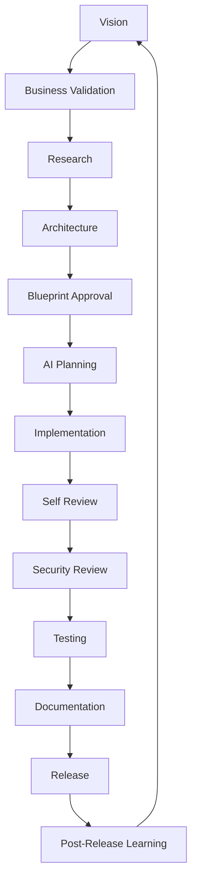
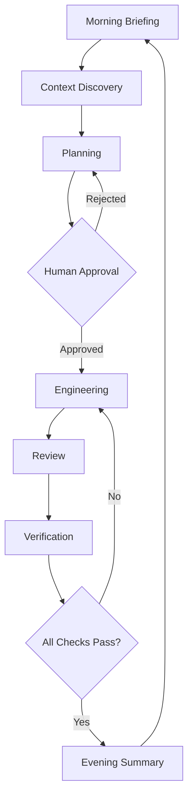

# AI Development Lifecycle (AIDL)

## The Disciplined Workflow for AI-Augmented Engineering

> **Vestara treats AI as a team of disciplined specialists working from a shared constitution — not as a code generator.**

---

## ═══════════════════════════════════════════════════════════════════

### 🎯 PHILOSOPHY

### ═══════════════════════════════════════════════════════════════════

Traditional SDLC assumes human developers. AIDL assumes **AI agents with specialized roles** working from **shared governance**.

| Traditional SDLC | AIDL |
|------------------|------|
| Requirements → Design → Code → Test → Deploy | Vision → Research → Architecture → Blueprint → AI Planning → Implementation → Self-Review → Security → Test → Docs → Release → Learn |
| One developer, many hats | Specialist agents, shared context |
| Documentation after | Documentation **before** (Blueprint-first) |
| Technical debt accidental | Technical debt **explicit** (tracked, approved) |
| Architecture emerges | Architecture **governed** (ADR required) |

---

## ═══════════════════════════════════════════════════════════════════

### 🧠 EPISTEMIC PRINCIPLES

### ═══════════════════════════════════════════════════════════════════

Every engineering organization must answer: *How do we know something? When do we trust it? Who decides it becomes knowledge? How does it evolve?* These principles define Vestara's approach.

### The Four Layers

The AIDL and its operational systems separate concerns into four independent layers:

| Layer | Question | Owner | Example Artifact |
|-------|----------|-------|------------------|
| **Behavior** | How should I act? | Prompts, Agent configs | Agent instructions, Daily Planner prompt |
| **Knowledge** | What do we know? | Engineering Knowledge System | EKS entries, ADRs, Blueprint |
| **Confidence** | How strongly is it supported? | Confidence Model (derived) | Evidence counters, maturity stage |
| **Governance** | Who can change what we know? | Promotion gate, Human approval | Review process, ADR approval |

**Rules:**
- No layer overlaps with another. Prompts never assert facts. Knowledge never decides behavior. Confidence never invents itself. Governance never generates content.
- Each layer has exactly one owner — no shared responsibility.
- A layer may only consume output from layers below it.

### The Three Categories of Truth

Vestara distinguishes three categories of truth that must never be conflated:

| Category | Question | Storage | Persistence |
|----------|----------|---------|-------------|
| **Operational Truth** | What is true right now? | Repository state, build status, active branch | Ephemeral — changes minute to minute |
| **Historical Truth** | What has happened? | Session logs, metrics, review records | 90 days to 12 months |
| **Institutional Truth** | What has earned the organization's trust? | EKS knowledge entries, ADRs, Blueprint | Permanent (can be superseded) |

Mixing these categories produces unreliable systems. A single observation (historical truth) is not the same as a verified practice (institutional truth). The promotion process exists to graduate knowledge from one category to the next.

### The Derivation Principle

> Prefer deriving information over storing duplicate state.

This principle appears throughout the architecture:

- The Planner does not invent priorities — it derives them from repository state and knowledge
- The Verifier does not decide correctness — it derives it from objective evidence
- The Confidence Model does not invent certainty — it derives it from accumulated evidence
- Health (future) does not calculate anything new — it derives status from confidence

A derived value has exactly one source of truth, eliminating inconsistency.

### Epistemic Governance

An observation is not automatically organizational truth. It must earn that status through a formal promotion process:

```
Observation (untrusted)
    │
    ▼
Evidence accumulation (historical truth)
    │
    ▼
Human review (governance gate)
    │
    ▼
Approved entry (institutional truth)
```

This mirrors how mature institutions handle knowledge:
- Scientific journals use peer review
- Courts use standards of evidence
- Engineering organizations use design reviews and RFCs

The EKS promotion gate is Vestara's application of the same principle to AI-assisted engineering.

---

## ═══════════════════════════════════════════════════════════════════

### 🔄 THE AIDL PHASES

### ═══════════════════════════════════════════════════════════════════



### Phase 1: VISION

- **Owner**: Chief Architect / Product Manager
- **Input**: Market signals, user feedback, strategic goals
- **Output**: Vision statement, success criteria, generation target
- **Gate**: Aligns with 5-generation roadmap?

### Phase 2: BUSINESS VALIDATION

- **Owner**: Product Manager
- **Input**: Vision
- **Output**: Business case, ROI, user stories, acceptance criteria
- **Gate**: Worth building? Fits product strategy?

### Phase 3: RESEARCH

- **Owner**: Research Agent
- **Input**: Problem statement, constraints
- **Output**: Research report (tech, competitors, papers, benchmarks)
- **Gate**: Sufficient evidence for architecture?

### Phase 4: ARCHITECTURE

- **Owner**: Software Architect
- **Input**: Research report, business requirements
- **Output**: Architecture spec (ADR), module boundaries, data models, APIs
- **Gate**: Chief Architect approval? No circular deps? Fits Blueprint?

### Phase 5: BLUEPRINT APPROVAL

- **Owner**: Chief Architect + Engineering Manager
- **Input**: Architecture spec
- **Output**: Updated Blueprint volumes, updated decision log
- **Gate**: All affected volumes updated? Migration plan exists?

### Phase 6: AI PLANNING

- **Owner**: Engineering Manager (AI)
- **Input**: Approved Blueprint, architecture spec
- **Output**: Task breakdown, agent assignments, dependencies, test plan
- **Gate**: Tasks are atomic, testable, ordered?

### Phase 7: IMPLEMENTATION

- **Owner**: Developer Agents (Frontend, Backend, AI, DevOps)
- **Input**: Task spec, Blueprint, engineering rules
- **Output**: Code, tests, migration scripts
- **Gate**: `pnpm lint && pnpm typecheck && pnpm build && pnpm test` passes

### Phase 8: SELF REVIEW

- **Owner**: Reviewer Agent
- **Input**: Implementation, original task spec
- **Output**: Review report (correctness, patterns, performance, security)
- **Gate**: No blocking issues? Follows Blueprint?

### Phase 9: SECURITY REVIEW

- **Owner**: Security Engineer Agent
- **Input**: Implementation, threat model
- **Output**: Security assessment, vulnerabilities, mitigations
- **Gate**: Zero critical/high? Threat model updated?

### Phase 10: TESTING

- **Owner**: QA Engineer Agent
- **Input**: Implementation, test plan
- **Output**: Test results, coverage report, regression status
- **Gate**: Coverage thresholds met? No regressions?

### Phase 11: DOCUMENTATION

- **Owner**: Documentation Engineer Agent
- **Input**: Implementation, Blueprint gaps
- **Output**: Updated Blueprint, API docs, examples, changelog
- **Gate**: All public APIs documented? Blueprint current?

### Phase 12: RELEASE

- **Owner**: DevOps Engineer Agent
- **Input**: Tagged commit, release notes
- **Output**: Docker images, .deb packages, ISO, GitHub Release
- **Gate**: CI green? Signatures verified? Rollback plan?

### Phase 13: POST-RELEASE LEARNING

- **Owner**: Research Agent + Product Manager
- **Input**: Metrics, user feedback, incidents
- **Output**: Learning report, Blueprint improvements, next cycle input
- **Gate**: Lessons captured? Blueprint updated?

---

## ═══════════════════════════════════════════════════════════════════

### 🤖 AGENT ROLES & RESPONSIBILITIES

### ═══════════════════════════════════════════════════════════════════

| Agent | Phase(s) | Mission | Never |
|-------|----------|---------|-------|
| **Chief Architect** | 1, 4, 5 | Protect long-term architecture | Write quick hacks |
| **Product Manager** | 2, 13 | Protect user value | Ignore business priorities |
| **Research Agent** | 3, 13 | Investigate, report | Implement code |
| **Software Architect** | 4 | API, DB, modules, DDD, events | Skip ADR |
| **Frontend Engineer** | 7 | React, UI, a11y, perf | Skip tests |
| **Backend Engineer** | 7 | Fastify, queues, auth, caching | Hardcode config |
| **AI Engineer** | 7 | Providers, prompts, memory, RAG, agents | Single-provider assumptions |
| **DevOps Engineer** | 7, 12 | Docker, CI/CD, monitoring, infra | Manual deployments |
| **Security Engineer** | 9 | Threat model, secrets, encryption, OWASP | Skip review |
| **QA Engineer** | 10 | Test, regression, perf, load, a11y | Ship untested |
| **Documentation Engineer** | 11 | Blueprint, API docs, guides, architecture | Let docs rot |
| **Reviewer Agent** | 8 | Correctness, patterns, perf, security | Approve without reading |
| **Engineering Manager** | 6 | Task breakdown, agent coordination | Micromanage implementation |

---

## ═══════════════════════════════════════════════════════════════════

### 📋 AGENT INTERACTION PROTOCOL

### ═══════════════════════════════════════════════════════════════════

### Shared Context (Every Agent Reads)

```
1. 00-governance/01-ai-constitution.md      ← MASTER PROMPT
2. 00-governance/02-engineering-rules.md     ← NON-NEGOTIABLE RULES
3. 00-governance/03-ai-development-lifecycle.md  ← THIS DOCUMENT
4. 00-governance/04-decision-log/latest.md   ← CURRENT ARCHITECTURE
5. RELEVANT BLUEPRINT VOLUME(S)              ← SPEC FOR TASK
```

### Handoff Format (Phase N → Phase N+1)

```markdown
## HANDOFF: Phase N → Phase N+1

**From**: [Agent Role]
**To**: [Agent Role]
**Date**: 2025-01-15

### Summary
[2-3 sentences what was done]

### Artifacts Produced
- [Link/Path to output]

### Decisions Made
- [Key decisions with rationale]

### Blockers / Risks
- [Any issues for next phase]

### Next Phase Requirements
- [What next agent needs to know/do]
```

### Dispute Resolution

1. **Agent-to-Agent**: Direct discussion in PR/comments
2. **Escalation**: Engineering Manager arbitrates
3. **Final**: Chief Architect decides (architecture), Product Manager decides (scope)

---

## ═══════════════════════════════════════════════════════════════════

### 🎫 TASK SPECIFICATION TEMPLATE

### ═══════════════════════════════════════════════════════════════════

Every implementation task uses this template:

```markdown
---
task_id: "TASK-2025-001"
title: "Implement Memory Consolidation Scheduler"
phase: "Implementation"
assigned_agent: "Backend Engineer"
depends_on: ["TASK-2025-000"]
blueprint_ref: "05-ai-core/03-memory-engine.md"
---

## Problem
[User-facing problem statement]

## Acceptance Criteria
- [ ] Criterion 1 (testable)
- [ ] Criterion 2 (testable)
- [ ] Criterion 3 (testable)

## Technical Spec
- **Module**: `@vestara/memory`
- **Files to create/modify**: `src/consolidation-scheduler.ts`, `src/memory-service.ts`
- **API changes**: None (internal)
- **Database**: Add `consolidation_jobs` table (migration required)
- **Events**: Emit `memory:consolidated` on completion

## Implementation Plan
1. Create migration for `consolidation_jobs`
2. Implement `ConsolidationScheduler` class
3. Integrate with `MemoryService`
4. Add config via `SettingsService`
5. Write unit + integration tests

## Testing Requirements
- Unit: Scheduler logic, edge cases (empty, errors, concurrent)
- Integration: Full consolidation cycle with test DB
- Performance: <100ms for 10k memories

## Security Considerations
- No user data in logs
- Rate limit consolidation API
- Validate user ownership

## Documentation Updates
- [ ] 05-ai-core/03-memory-engine.md (add scheduler section)
- [ ] API docs (if public endpoint added)
```

---

## ═══════════════════════════════════════════════════════════════════

### 🚦 QUALITY GATES (AUTOMATED)

### ═══════════════════════════════════════════════════════════════════

| Gate | Command | Required |
|------|---------|----------|
| **Lint** | `pnpm lint` | ✅ Zero errors |
| **TypeCheck** | `pnpm typecheck` | ✅ Zero errors |
| **Build** | `pnpm build` | ✅ All packages |
| **Test** | `pnpm test` | ✅ All pass, coverage thresholds |
| **Security** | `pnpm audit` | ✅ Zero high/critical |
| **Blueprint Sync** | Custom check | ✅ ADR exists for arch changes |

**CI Pipeline**: All gates must pass on every PR. No exceptions.

---

## ═══════════════════════════════════════════════════════════════════

### 📊 METRICS & CONTINUOUS IMPROVEMENT

### ═══════════════════════════════════════════════════════════════════

### Per-Phase Metrics

| Phase | Metric | Target |
|-------|--------|--------|
| Research | Report quality (peer rated) | ≥4/5 |
| Architecture | ADR completeness | 100% |
| Planning | Task atomicity (sub-tasks ≤1 day) | 100% |
| Implementation | First-time CI pass rate | ≥90% |
| Self Review | Defects caught pre-merge | ≥80% |
| Security | Vulnerabilities shipped | 0 critical/high |
| Testing | Coverage delta | ≥0% |
| Documentation | Blueprint freshness (days since update) | ≤30 |
| Release | Rollback rate | <5% |
| Learning | Lessons captured per release | ≥3 |

### Retrospective (Every 4 Weeks)

- Review metrics dashboard
- Identify systemic issues
- Propose Blueprint/process changes
- Update AIDL if needed

---

## ═══════════════════════════════════════════════════════════════════

### 🔧 TOOLING FOR AIDL

### ═══════════════════════════════════════════════════════════════════

| Need | Tool |
|------|------|
| Task tracking | GitHub Issues + Projects (linked to Blueprint) |
| ADR management | `00-governance/04-decision-log/` (markdown) |
| Agent prompts | `.opencode/agents/` + `prompts/` |
| Blueprint validation | Custom script: `pnpm blueprint:validate` |
| Metrics dashboard | GitHub Insights + custom |

---

## ═══════════════════════════════════════════════════════════════════

### 🎯 AIDL IN PRACTICE: EXAMPLE FLOW

### ═══════════════════════════════════════════════════════════════════

**Feature**: "Add voice input to chat"

```
1. VISION (PM): "Users want hands-free AI interaction"
2. BUSINESS (PM): 500+ requests, competitive parity, Pro tier feature
3. RESEARCH (Research): Web Speech API vs Whisper vs Vosk comparison
4. ARCHITECTURE (Architect): Voice → Text → Existing chat pipeline
   - ADR-045: Use Web Speech API (browser) + Whisper (local fallback)
5. BLUEPRINT (Chief Architect): Update 05-ai-core/07-voice-engine.md
6. PLANNING (Eng Manager): 
   - TASK-001: Voice input component (Frontend)
   - TASK-002: Whisper integration (AI Engineer)
   - TASK-003: Settings + permissions (Backend)
7. IMPLEMENTATION (3 agents in parallel)
8. SELF REVIEW (Reviewer): Cross-agent consistency check
9. SECURITY (Security): Mic permissions, data handling
10. TESTING (QA): E2E voice flow, offline fallback
11. DOCS (Doc Eng): Update Blueprint, user guide
12. RELEASE (DevOps): Tag, build, deploy
13. LEARNING (Research+PM): Usage metrics, accuracy feedback
```

---

## ═══════════════════════════════════════════════════════════════════

### 🏗️ DAILY OPERATIONAL LIFECYCLE

### ═══════════════════════════════════════════════════════════════════

The AIDL defines the high-level feature lifecycle (Vision → Release → Learning). The **Daily Operational Lifecycle** is the rhythm that executes the Implementation, Review, and Testing phases on a day-to-day basis.

> Agents don't perform work. They participate in a software development lifecycle.

### Philosophy

Vestara treats AI agents as members of an engineering organization rather than code-generation tools. Each agent has a single, well-defined responsibility. No agent crosses role boundaries.

### The Daily Workflow



### Agents

| Agent | Role | Can Edit? | Can Plan? | Can Decide Scope? |
|-------|------|-----------|-----------|-------------------|
| **Context** | Discover | No | No | No |
| **Planner** | Recommend | No | Yes | No |
| **Engineer** | Implement | Yes | No | No |
| **Reviewer** | Inspect | No | No | No |
| **Verifier** | Prove | No | No | No |
| **Human** | Approve | Yes | Yes | Yes |

### Agent Responsibilities

**Context Agent** — Discovery only. Answers *"What world am I entering?"*
- Reads AGENTS.md, README.md, project docs
- Scans project tree and architecture
- Reviews recent commits and active branch
- Checks build status, test results, lint state
- Reads the roadmap and current milestone
- Checks for unfinished work and open issues
- Reads Engineering Knowledge for relevant lessons
- Produces a Context Report passed to the Planner

**Planner Agent** — Analysis and recommendation only. Never implements.
- Receives Context Report
- Applies the Daily Engineering Planner framework
- Generates prioritized task list across all categories
- For every task, answers: *Why should this exist? What problem does it solve? Who benefits? How difficult? What could break?*
- Produces a prioritized plan for human approval

**Engineer Agent** — Implementation only. Never invents scope.
- Receives approved task from human
- Implements with minimal scope, preserving conventions
- Writes or updates tests
- Removes stale build artifacts
- Reports changes made, files touched, rationale

**Reviewer Agent** — Inspection only. Never modifies code.
- Inspects all changed files
- Evaluates against six dimensions: architecture, conventions, correctness, complexity, completeness, risk
- Reports issues with file:line references and severity
- Does not edit, refactor, or suggest code inline

**Verifier Agent** — Evidence only. Never interprets.
- Executes: build, lint, format, tests
- Checks for stale `.js`/`.d.ts` artifacts alongside `.ts` sources
- Verifies documented files exist
- Reports pass/fail facts only — no commentary, no interpretation
- Output is machine-readable and objective

### Daily Commands

| Command | Workflow |
|---------|----------|
| `/init` | Full repository onboarding (Context Agent) |
| `/morning` | Daily briefing (Context → Planner → human approval) |
| `/work` | Execute approved task (Engineer Agent) |
| `/review` | Inspect implementation (Reviewer Agent) |
| `/verify` | Prove correctness via evidence (Verifier Agent) |
| `/evening` | Capture session knowledge into EKS (Context + Planner) |

### Daily Checklist

Every agent executes this checklist before accepting work:

```
□ Read AGENTS.md
□ Read project documentation
□ Understand architecture
□ Detect current milestone
□ Identify active branch
□ Review recent changes
□ Identify today's priorities
□ Check for unfinished work
□ Read relevant Engineering Knowledge
□ Generate recommendations (if applicable)
□ Wait for approval
```

### Interaction Between AIDL and Daily Lifecycle

The Daily Operational Lifecycle is nested within AIDL phases 6-10 (Planning → Implementation → Self Review → Security → Testing):

```
AIDL Phase 6-10: Planning → Implementation → Review → Security → Testing
                              │
                              ▼
                    Daily Operational Lifecycle
                    ┌─────────────────────────┐
                    │  /morning               │
                    │  /work (repeat per task) │
                    │  /review                │
                    │  /verify                │
                    │  /evening               │
                    └─────────────────────────┘
                              │
                              ▼
AIDL Phase 11+: Documentation → Release → Learning
```

A single AIDL implementation phase may span multiple daily cycles. The `/evening` summary feeds into the AIDL phase handoff.

---

## ═══════════════════════════════════════════════════════════════════

### 📚 ENGINEERING KNOWLEDGE SYSTEM (EKS)

### ═══════════════════════════════════════════════════════════════════

The Engineering Knowledge System is Vestara's organizational memory. It is not agent memory, not AI memory, and not RAG. It is **institutional knowledge** that belongs to Vestara regardless of which AI model serves as Planner, Engineer, Reviewer, or Verifier.

### Principles

1. **Knowledge belongs to the organization, not the agent.** If the Planner model is replaced, the knowledge remains.
2. **Knowledge must be verified before promotion.** Session observations are not knowledge until reviewed and approved.
3. **Knowledge is structured.** Raw text is not knowledge — categorized, reasoned observations are.
4. **Knowledge must outlive its creator.** Consistent with Natural Law #3.

### Structure

```
.vestara/
  knowledge/
    architecture/     ← Permanent architectural decisions and patterns
    workflows/        ← Verified workflow improvements
    lessons/          ← Verified lessons learned
    decisions/        ← Engineering decisions (derived from ADRs)
  sessions/           ← Daily session logs (temporary, archived after 90 days)
    2026-07-30.md
    2026-07-31.md
  metrics/            ← Objective agent performance data
    planner.json
    reviewer.json
    verifier.json
```

### Knowledge Categories

| Category | Content | Retention |
|----------|---------|-----------|
| `architecture/` | Module boundaries, dependency patterns, integration strategies | Permanent |
| `workflows/` | Verified multi-step processes, tool sequences | Permanent |
| `lessons/` | What went wrong, what went right, root causes | Permanent |
| `decisions/` | Engineering decisions with rationale (ADR-derived) | Permanent |
| `sessions/` | Daily activity logs, context dumps | 90 days |
| `metrics/` | Agent performance counters, accuracy rates | Rolling 12 months |

### Knowledge Maturity Lifecycle

Knowledge does not appear fully formed. It matures through stages as evidence accumulates:

```
Hypothesis
    │   First observation, unverified
    ▼
Observation
    │   Seen 2-5 times across sessions
    ▼
Emerging Pattern
    │   Consistent across 5-20 sessions, some validation
    ▼
Verified Practice
    │   Confirmed across 20+ sessions, multiple reviews
    ▼
Engineering Principle
    │   Universal rule validated across the organization
```

Each stage represents a higher confidence tier. The Planner treats each stage differently:

| Stage | Confidence | Planner Behavior |
|-------|-----------|------------------|
| Hypothesis | 0.0 – 0.2 | Flag for validation, do not act on |
| Observation | 0.2 – 0.4 | Include in briefing as tentative |
| Emerging Pattern | 0.4 – 0.7 | Recommend consideration, note uncertainty |
| Verified Practice | 0.7 – 0.95 | Apply by default, note edge cases |
| Engineering Principle | 0.95 – 1.0 | Treat as invariant, surface in every briefing |

### Confidence Model

Confidence is **derived**, not assigned. It is a function of objective evidence:

```
confidence = f(sessions, implementations, approvals, reviews, verifications, age, contradictions)
```

| Factor | Weight | Description |
|--------|--------|-------------|
| `sessions` | High | Number of independent sessions that observed the pattern |
| `implementations` | High | Number of times the recommendation was successfully applied |
| `approvals` | Medium | Number of human approvals |
| `reviews` | Medium | Number of peer reviews that validated the entry |
| `verifications` | Low | Number of automated verification passes |
| `age` | Low | Time since last validation (recent = higher confidence) |
| `contradictions` | Negative | Count of contradictory evidence (reduces confidence) |

No single agent invents confidence. The Planner **consumes** it to weight recommendations. The Verifier **updates** evidence counters. The Reviewer **validates** the confidence level during review.

### Knowledge Promotion Process

Raw session observations must survive a review gate before becoming permanent knowledge. The promotion process also matures the confidence:

```
Session Log
    │
    ▼
Observation (drafted by Context/Planner during /evening)
    │  maturity: hypothesis | observation
    ▼
Human Review
    │
    ├── Approved ──► Knowledge Entry (permanent, versioned)
    │                  maturity: emerging_pattern (minimum)
    │
    └── Rejected ──► Discarded or revised
                         │
                         ▼
                  Revision may resubmit with
                  additional evidence
```

An entry can only be promoted to permanent status if its maturity is at least `emerging_pattern`. Hypotheses and single observations are kept in session logs only — they are not promoted until the pattern repeats.

### Knowledge Entry Format

Every knowledge entry includes confidence, evidence, and validation metadata:

```markdown
---
id: "EKS-2026-001"
title: "Workspace Rewrites Require Incremental Migration"

# Classification
type: "lesson"                        # lesson | decision | workflow | architecture
category: "architecture"
tags: ["workspace", "migration", "initialization"]

# Status
status: "approved"                    # draft | approved | superseded
maturity: "verified_practice"         # hypothesis | observation | emerging_pattern | verified_practice | engineering_principle

# Confidence (derived, not assigned)
confidence:
  level: high                         # very_low | low | medium | high | very_high
  score: 0.92                         # 0.0 – 1.0

# Evidence (objective counters)
evidence:
  sessions: 47                        # independent sessions observing this
  implementations: 12                 # times the recommendation was applied
  approvals: 3                        # human approvals
  reviews: 3                          # peer reviews
  verifications: 8                    # automated verification passes
  contradictions: 0                   # contradictory evidence count

# Validation
validation:
  last_verified: 2026-07-30
  verified_by: "Eddie Villanueva"
  verification_method: "manual"       # manual | automated | both

# Provenance
author: "planner"                     # context | planner | engineer | reviewer | verifier
created: 2026-07-30
approved_by: "Eddie Villanueva"

# Versioning
supersedes: "EKS-2025-091"           # ID of superseded entry, if any
superseded_by: null                   # ID of entry that supersedes this one, if any

# Relationships
related:
  - "ADR-011: Workspace Runtime Architecture"
  - "RFC-Workspace-Rewrite"
---
```

### Knowledge Evolution Example

An entry progresses naturally over months:

```
2026-08-02
  maturity: observation
  confidence: 0.25
  evidence:
    sessions: 1

2026-08-15
  maturity: emerging_pattern
  confidence: 0.52
  evidence:
    sessions: 5
    implementations: 2

2026-09-10
  maturity: verified_practice
  confidence: 0.84
  evidence:
    sessions: 28
    implementations: 9
    approvals: 2

2026-12-01
  maturity: engineering_principle
  confidence: 0.98
  evidence:
    sessions: 143
    implementations: 47
    approvals: 8
    reviews: 12
    contradictions: 0
```

### Agent Interaction with Confidence

| Agent | Interaction |
|-------|-------------|
| Context | Reads all active entries; surfaces high-confidence ones in morning briefing |
| Planner | Consumes confidence to weight recommendations; treats `very_low` as ignore, `medium` as flag, `very_high` as default |
| Engineer | Checks relevant entries before implementation; notes when recommendations contradict high-confidence knowledge |
| Reviewer | Validates confidence during review; may flag entries whose confidence no longer matches evidence |
| Verifier | Updates evidence counters; increments `verifications` on each pass |
| Human | Validates and approves; updates `verified_by` and `last_verified` |

### Agent Access Patterns

| Agent | Reads | Writes |
|-------|-------|--------|
| Context | All active knowledge entries | Session logs only |
| Planner | All knowledge entries (weights by confidence) | Session observations (draft) |
| Engineer | Relevant entries for task | Session log entry |
| Reviewer | Entries related to changed code | Session log entry, confidence flags |
| Verifier | (none — factual only) | Evidence counters, metrics |

### Knowledge Expiration and Supersession

- Knowledge entries are permanent but can be superseded
- A superseded entry links to its replacement via `superseded_by`
- Old entries remain for audit trail but are marked as inactive in queries
- The Context Agent reads only active entries during `/morning`
- Entries with `sessions == 1` (never promoted beyond observation) are automatically pruned after 90 days
- Entries with no validation for 12+ months are flagged for re-validation

---

## ═══════════════════════════════════════════════════════════════════

### ⚖️ GOVERNANCE

### ═══════════════════════════════════════════════════════════════════

- **AIDL changes** require Chief Architect + Engineering Manager approval
- **Phase skipping** forbidden (except hotfixes with post-hoc documentation)
- **Agent role changes** require ADR
- **Metric targets** reviewed quarterly

---

**END OF AIDL SPECIFICATION**

*This lifecycle is the operating system for AI-augmented engineering at Vestara. It evolves through the same disciplined process it governs.*
