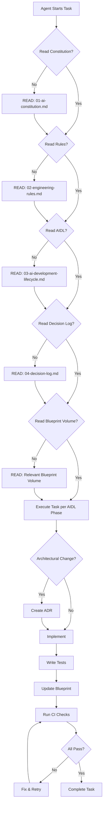

# AI Agent Compatibility
## Universal Integration for All AI Assistants

> **Vestara works the same way regardless of which AI model you use. This document ensures consistent behavior across Claude, OpenCode, Codex, Cursor, Copilot, Windsurf, and future models.**

---

## ═══════════════════════════════════════════════════════════════════
### 🎯 COMPATIBILITY PRINCIPLE
### ═══════════════════════════════════════════════════════════════════

**The model may change, but the project's direction, quality bar, and long-term vision remain consistent.**

Every AI agent interacting with Vestara codebase MUST:
1. Read the Constitution (`01-ai-constitution.md`) FIRST
2. Read the Engineering Rules (`02-engineering-rules.md`) SECOND
3. Read the AIDL (`03-ai-development-lifecycle.md`) THIRD
4. Read the Decision Log (`04-decision-log.md`) FOURTH
5. Read the relevant Blueprint volume for the task

**No exceptions. No shortcuts.**

---

## ═══════════════════════════════════════════════════════════════════
### 🤖 SUPPORTED AI AGENTS
### ═══════════════════════════════════════════════════════════════════

| Agent | Configuration | Entry Point | Notes |
|-------|---------------|-------------|-------|
| **Claude Code** | `.claude/` | `CLAUDE.md` | Reads AGENTS.md + Blueprint |
| **OpenCode** | `.opencode/` | `opencode.json` | Native provider, embedded |
| **Codex** | `.codex/` | `AGENTS.md` | OpenAI's agent |
| **Cursor** | `.cursor/` | `.cursorrules` | VS Code fork |
| **Windsurf** | `.windsurf/` | `.windsurfrules` | Codeium |
| **GitHub Copilot** | `.github/copilot/` | `copilot-instructions.md` | VS Code/GitHub |
| **Gemini CLI** | `.gemini/` | `GEMINI.md` | Google's CLI |

---

## ═══════════════════════════════════════════════════════════════════
### 📄 AGENT CONFIGURATION FILES
### ═══════════════════════════════════════════════════════════════════

### Root AGENTS.md (Universal)
```markdown
# AGENTS.md
Repository: Vestara AI OS
Read these first:
- vestara-blueprint/00-governance/01-ai-constitution.md
- vestara-blueprint/00-governance/02-engineering-rules.md
- vestara-blueprint/00-governance/03-ai-development-lifecycle.md
- vestara-blueprint/00-governance/04-decision-log.md

Never implement code before reading them.
All generated code must follow Blueprint.
Documentation is mandatory.
Architecture takes priority over implementation.
Every change requires updating documentation.
```

### CLAUDE.md (Claude Code)
```markdown
# CLAUDE.md
# Vestara AI OS — Claude Code Instructions

## Project Context
Vestara is a portable AI operating system that boots from an external SSD.
Tech: TypeScript, Node.js 22, Fastify, SQLite, React 19, Tailwind 4, Turborepo.

## Critical Rules
- ALWAYS read vestara-blueprint/00-governance/01-ai-constitution.md first
- Use @vestara/types for ALL type definitions
- Use @vestara/validation for ALL Zod schemas
- Use VestaraApp type (not FastifyInstance) for routes
- SQLite only — no PostgreSQL/MySQL
- OpenCode is default provider — works without API keys
- Ollama is on-demand only — no auto-start
- Run pnpm lint && pnpm typecheck && pnpm build && pnpm test before commit

## Commands
pnpm install | pnpm build | pnpm dev | pnpm lint | pnpm typecheck | pnpm test
```

### .cursorrules (Cursor)
```markdown
# Vestara AI OS — Cursor Rules

You are an elite AI engineer working on Vestara AI OS.
Read vestara-blueprint/00-governance/01-ai-constitution.md FIRST.

Rules:
- TypeScript strict mode, zero any
- Zod validation at all boundaries
- Feature-first module organization
- SQLite with parameterized queries
- VestaraApp type for Fastify routes
- SWR for data fetching
- Tailwind CSS 4 with vestara-* tokens
- No comments unless explaining WHY
- pnpm build must pass before commit
```

### .windsurfrules (Windsurf)
```markdown
# Vestara AI OS — Windsurf Rules

## Identity
You are a specialist AI engineer on the Vestara team.
Follow the AI Constitution: vestara-blueprint/00-governance/01-ai-constitution.md

## Workflow
1. Read Constitution, Rules, AIDL, Decision Log
2. Read relevant Blueprint volume
3. Create ADR if architectural decision needed
4. Implement with strict TypeScript + Zod
5. Write tests (Vitest, real SQLite)
6. Update Blueprint documentation
7. Run full CI check: pnpm lint && pnpm typecheck && pnpm build && pnpm test

## Patterns
- @vestara/types = single source of truth
- @vestara/validation = all boundaries
- Feature-first organization
- EventBus for service communication
- UUID v7 for IDs
```

### copilot-instructions.md (GitHub Copilot)
```markdown
# Vestara AI OS — Copilot Instructions

## Project
Portable AI OS booting from SSD. TypeScript, Fastify, SQLite, React, Tailwind.

## Critical Context (ALWAYS APPLY)
- Read vestara-blueprint/00-governance/01-ai-constitution.md first
- Strict TypeScript, zero `any`, Zod at boundaries
- Use @vestara/types, @vestara/validation, @vestara/utils
- SQLite parameterized queries only
- VestaraApp type for Fastify routes
- Provider-agnostic local inference, Ollama on-demand
- Feature-first modules, EventBus communication
- UUID v7 IDs, ISO 8601 timestamps

## Code Style
- kebab-case files, PascalCase types, camelCase functions
- Explicit return types on all functions
- Composition over inheritance
- JSDoc for public APIs
- No console.log (use @vestara/core/logger)
```

---

## ═══════════════════════════════════════════════════════════════════
### 🔄 UNIVERSAL WORKFLOW FOR ALL AGENTS
### ═══════════════════════════════════════════════════════════════════



---

## ═══════════════════════════════════════════════════════════════════
### ⚙️ AGENT-SPECIFIC CAPABILITIES
### ═══════════════════════════════════════════════════════════════════

| Capability | Claude | OpenCode | Codex | Cursor | Windsurf | Copilot | Gemini |
|------------|--------|----------|-------|--------|----------|---------|--------|
| Read Blueprint | ✅ | ✅ | ✅ | ✅ | ✅ | ✅ | ✅ |
| Write Code | ✅ | ✅ | ✅ | ✅ | ✅ | ✅ | ✅ |
| Run Commands | ✅ | ✅ | ✅ | ✅ | ✅ | ⚠️ | ✅ |
| Run Tests | ✅ | ✅ | ✅ | ✅ | ✅ | ⚠️ | ✅ |
| Git Operations | ✅ | ✅ | ✅ | ✅ | ✅ | ⚠️ | ✅ |
| File Operations | ✅ | ✅ | ✅ | ✅ | ✅ | ✅ | ✅ |
| Web Search | ✅ | ❌ | ❌ | ❌ | ❌ | ❌ | ✅ |
| Multi-file Edit | ✅ | ✅ | ✅ | ✅ | ✅ | ✅ | ✅ |
| Architectural Reasoning | ✅ | ✅ | ✅ | ✅ | ✅ | ⚠️ | ✅ |

**Note**: All agents MUST follow the same Constitution regardless of capabilities.

---

## ═══════════════════════════════════════════════════════════════════
### 🎯 AGENT ROLE MAPPING (AIDL)
### ═══════════════════════════════════════════════════════════════════

When an AI agent receives a task, it assumes the appropriate **AIDL role**:

| Task Type | Agent Assumes Role |
|-----------|-------------------|
| Architecture decision | Software Architect |
| API design | Backend Engineer |
| Database schema | Backend Engineer |
| UI component | Frontend Engineer |
| AI provider integration | AI Engineer |
| Memory/RAG system | AI Engineer |
| Agent runtime | AI Engineer |
| Docker/CI/CD | DevOps Engineer |
| Security audit | Security Engineer |
| Test writing | QA Engineer |
| Documentation | Documentation Engineer |
| Research | Research Agent |
| Product prioritization | Product Manager |
| Long-term architecture | Chief Architect |

**The same model can play different roles** depending on the task. The role determines:
- Which Blueprint volumes to read
- What quality gates apply
- What review criteria matter

---

## ═══════════════════════════════════════════════════════════════════
### 🔧 INTEGRATION POINTS
### ═══════════════════════════════════════════════════════════════════

### OpenCode (Native Provider)
- Embedded in dashboard via iframe on port 4096
- Theme injection via CSS variables + localStorage
- Configured in `~/.config/opencode/opencode.json`
- **No API keys required** for free models

### Ollama (Local Models)
- On-demand startup via Provider Router
- Default model: `ollama/deepseek-coder`
- No background processes
- Models managed by Ollama CLI

### External Providers (OpenAI, Anthropic, Google)
- API keys in `.env` (gitignored)
- Configured via `@vestara/config`
- Routed through AI Provider Router
- Fallback chain: OpenCode → Ollama → External

---

## ═══════════════════════════════════════════════════════════════════
### 📋 COMPLIANCE CHECKLIST (FOR AI AGENTS)
### ═══════════════════════════════════════════════════════════════════

Before completing ANY task, verify:

```markdown
- [ ] Read 01-ai-constitution.md (Master Prompt)
- [ ] Read 02-engineering-rules.md (Non-negotiable rules)
- [ ] Read 03-ai-development-lifecycle.md (AIDL workflow)
- [ ] Read 04-decision-log.md (Current architecture)
- [ ] Read relevant Blueprint volume(s) for task
- [ ] Identified AIDL phase for this task
- [ ] Assumed correct AIDL role for task
- [ ] Created ADR if architectural decision made
- [ ] Used @vestara/types for all types
- [ ] Used @vestara/validation for all boundaries
- [ ] Used VestaraApp type for Fastify routes
- [ ] Parameterized queries only (no SQL injection)
- [ ] Strict TypeScript (zero any)
- [ ] Tests written (Vitest, real SQLite)
- [ ] Documentation updated (Blueprint + JSDoc)
- [ ] pnpm lint && pnpm typecheck && pnpm build && pnpm test passes
```

---

## ═══════════════════════════════════════════════════════════════════
### 🚀 FUTURE-PROOFING
### ═══════════════════════════════════════════════════════════════════

As new AI agents emerge (GPT-5, Claude 4, Qwen 3, etc.), they integrate by:

1. **Reading this compatibility document**
2. **Creating their config file** (following patterns above)
3. **Following the universal workflow**
4. **Assuming AIDL roles** appropriate to tasks
5. **Contributing to the same Blueprint**

**The Constitution is model-agnostic. The Blueprint is model-agnostic. The AIDL is model-agnostic.**

---

**END OF COMPATIBILITY SPECIFICATION**

*This document ensures that whether the contributor uses ChatGPT, Claude, Gemini, Qwen, DeepSeek, Cursor, Codex, OpenCode, or another capable model, they all begin from the same principles, architecture, and engineering standards.*
