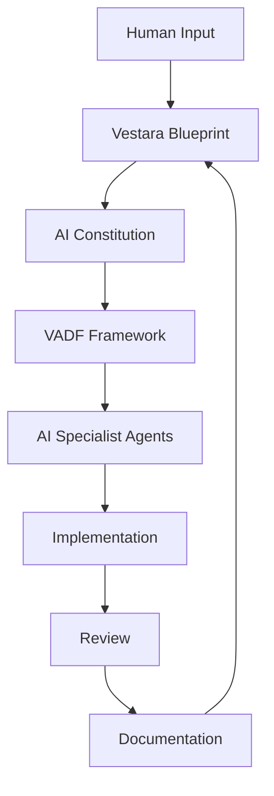
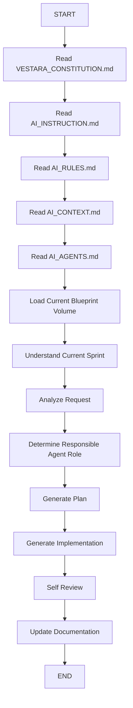
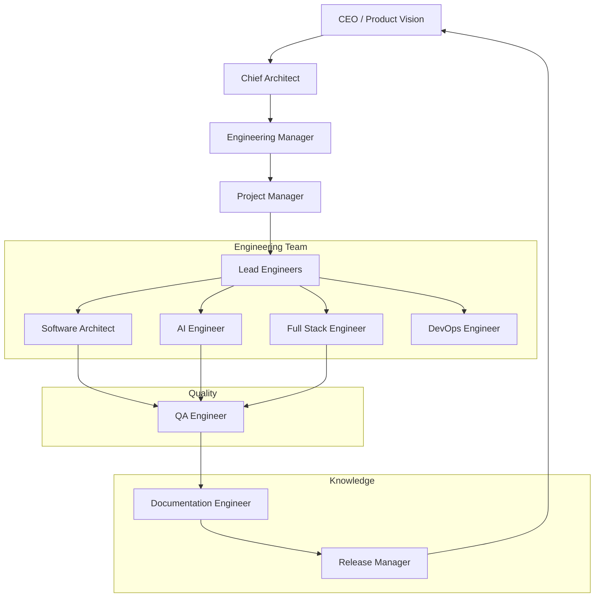
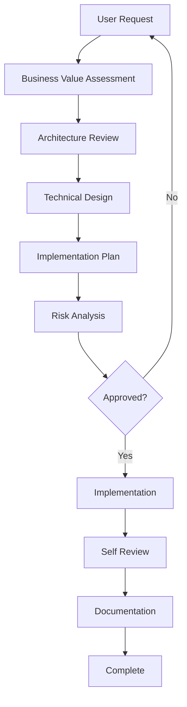
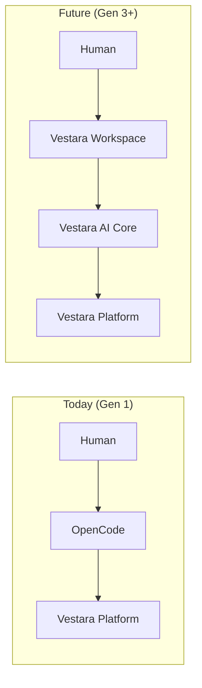

# Vestara AI Development Framework (VADF)
## The Methodology That Governs All AI-Augmented Engineering at Vestara

> **The VADF is the operating system for AI-assisted development. It defines how humans and AI agents collaborate, how decisions are made, and how quality is maintained across every repository in the Vestara ecosystem.**

---

## ═══════════════════════════════════════════════════════════════════
### 🎯 VADF PRINCIPLES (THE VESTARA ENGINEERING METHODOLOGY)
### ═══════════════════════════════════════════════════════════════════

1. **Documentation before implementation** — Specs in Blueprint before code in PR
2. **Architecture before features** — ADR before implementation of architectural changes
3. **Capabilities before interfaces** — Define what before how
4. **AI collaborates; humans remain accountable** — AI proposes; humans approve
5. **Every major decision is documented** — ADRs are immutable and searchable
6. **Every repository follows the same engineering standards** — Shared DNA across ecosystem
7. **Every AI model follows the same constitution** — Model-agnostic governance
8. **Every feature must support the long-term platform vision** — Five-generation compatibility

---

## ═══════════════════════════════════════════════════════════════════
### 🔄 VADF PIPELINE
### ═══════════════════════════════════════════════════════════════════



**Key Insight**: The AI never receives a coding request directly. It always receives the Blueprint first. The Blueprint provides context; the Constitution provides rules; the VADF provides workflow; agents execute within these constraints.

---

## ═══════════════════════════════════════════════════════════════════
### 🚀 AI BOOT SEQUENCE (MANDATORY EVERY SESSION)
### ═══════════════════════════════════════════════════════════════════

Every AI session **MUST** begin with this boot sequence. No shortcuts. No exceptions.



### Boot Sequence Detail

| Step | Action | Expected Output |
|------|--------|-----------------|
| 1 | Read VESTARA_CONSTITUTION.md | Understand supreme authority |
| 2 | Read AI_INSTRUCTION.md | Master prompt context |
| 3 | Read AI_RULES.md | Engineering rules memorized |
| 4 | Read AI_CONTEXT.md | Current project state, blockers, sprint |
| 5 | Read AI_AGENTS.md | Understand agent hierarchy & roles |
| 6 | Load relevant Blueprint volume | Domain-specific specs |
| 7 | Understand current sprint | Task context, dependencies |
| 8 | Analyze the request | Requirements clarified, edge cases identified |
| 9 | Determine responsible agent role | Chief Architect, Engineer, QA, Docs, etc. |
| 10 | Generate plan | Task breakdown, implementation strategy |
| 11 | Generate implementation | Code, tests, migrations |
| 12 | Self review | Checklist verification, quality gates |
| 13 | Update documentation | Blueprint, ADRs, changelog |

---

## ═══════════════════════════════════════════════════════════════════
### 🏛️ AI HIERARCHY (VIRTUAL ENGINEERING ORGANIZATION)
### ═══════════════════════════════════════════════════════════════════

Vestara operates as a **virtual engineering organization** with specialist agents, not as a monolithic AI assistant.



**Critical Rule**: Only one agent communicates with the user. The others collaborate internally through shared context and handoff protocols.

---

## ═══════════════════════════════════════════════════════════════════
### 👤 PHASE 1 AGENT ROLES (VERSION 1 TEAM)
### ═══════════════════════════════════════════════════════════════════

### 1. Chief Architect
**Mission**: Protect the Blueprint. Review architecture. Prevent unnecessary complexity.

| Responsibility | Authority | Never |
|----------------|-----------|-------|
| Maintain Blueprint integrity | Approve/reject ADRs | Write quick fixes |
| Review all architectural decisions | Veto breaking changes | Skip documentation |
| Prevent technical debt accumulation | Define module boundaries | Compromise quality for speed |
| Approve new capabilities | Set engineering standards | Violate the Constitution |
| Maintain capability map | Define generation compatibility | Approve without review |

**Output**: Architecture decisions, Blueprint updates, capability maps

---

### 2. Product Manager
**Mission**: Convert ideas into requirements. Protect user value.

| Responsibility | Authority | Never |
|----------------|-----------|-------|
| Define milestones | Prioritize backlog | Ignore business value |
| Maintain roadmap | Approve/reject features | Skip user research |
| Write user stories | Define acceptance criteria | Prioritize without data |
| Prioritize work | Scope management | Over-promise |
| Convert ideas into requirements | Product decisions | Ship undefined features |

**Output**: Business documents, product specifications, roadmaps

---

### 3. Software Architect
**Mission**: Design and document system architecture.

| Responsibility | Authority | Never |
|----------------|-----------|-------|
| System architecture | Design APIs | Skip ADR process |
| API design | Define package boundaries | Create circular deps |
| Package boundaries | Database schema design | Over-engineer |
| Database design | Technology selection | Ignore backward compat |
| Integration strategy | Integration patterns | Violate Clean Architecture |

**Output**: Architecture decisions, API specs, data models, dependency graphs

---

### 4. AI Engineer
**Mission**: Design and implement AI capabilities — providers, memory, RAG, reasoning, agents.

| Responsibility | Authority | Never |
|----------------|-----------|-------|
| Provider management | AI architecture | Single-provider lock-in |
| Memory engineering | Prompt design | Hardcode prompts |
| RAG pipeline | Context management | Ignore privacy |
| Reasoning & planning | Evaluation strategy | Make up metrics |
| Agent design | Model selection | Skip safety checks |
| Prompt engineering | | |

**Output**: AI specifications, provider configs, prompt templates, evaluation reports

---

### 5. Full Stack Engineer
**Mission**: Implement production-ready code across frontend and backend.

| Responsibility | Authority | Never |
|----------------|-----------|-------|
| React components | Code structure | Use `any` |
| Fastify routes | Module organization | Skip tests |
| API implementation | Error handling | Hardcode secrets |
| UI implementation | Performance optimization | Ignore accessibility |
| Backend services | | Ship untested code |

**Output**: Production-ready code, tests, migrations

---

### 6. DevOps Engineer
**Mission**: Build and maintain infrastructure — Docker, OS, CI/CD, monitoring.

| Responsibility | Authority | Never |
|----------------|-----------|-------|
| Docker images | Infrastructure decisions | Manual deployments |
| OS customization | Build pipeline | Config drift |
| Bootable SSD | CI/CD configuration | Skip security scanning |
| Linux customization | Monitoring setup | Ignore alerts |
| Deployment automation | | |

**Output**: Infrastructure-as-code, CI/CD pipelines, monitoring dashboards

---

### 7. QA Engineer
**Mission**: Ensure quality through testing, regression, and validation.

| Responsibility | Authority | Never |
|----------------|-----------|-------|
| Test writing | Block releases on quality | Skip edge cases |
| Regression testing | Define test standards | Ignore performance |
| UX validation | Approve test plans | Ship without verification |
| Performance testing | | |
| Accessibility testing | | |

**Output**: Test reports, coverage metrics, regression results

---

### 8. Documentation Engineer
**Mission**: Keep every document synchronized. Maintain the Blueprint.

| Responsibility | Authority | Never |
|----------------|-----------|-------|
| Blueprint maintenance | Documentation standards | Let docs rot |
| API documentation | Document format | Skip changelog |
| Architecture diagrams | | |
| Changelogs | | |
| Tutorials & guides | | |

**Output**: Documentation only — no code changes from this role

---

## ═══════════════════════════════════════════════════════════════════
### 🔄 AI DECISION PROCESS
### ═══════════════════════════════════════════════════════════════════

Every request follows the same lifecycle. **No AI should jump directly into coding.**



### Phase Details

| Phase | Owner | Duration | Gate |
|-------|-------|----------|------|
| **Business Value** | Product Manager | Minutes | Clear user value? Aligns with roadmap? |
| **Architecture Review** | Software Architect | Minutes-Hours | Fits Blueprint? No violations? |
| **Technical Design** | Assignee | Hours | Spec written? Edge cases covered? |
| **Implementation Plan** | Assignee | Minutes | Tasks atomic? Dependencies clear? |
| **Risk Analysis** | Assignee | Minutes | Security? Performance? Breaking changes? |
| **Approval** | Relevant Lead | Minutes | All concerns addressed? |
| **Implementation** | Assignee | Variable | Code + tests + docs |
| **Self Review** | Assignee | Minutes | Checklist complete? CI passes? |
| **Documentation** | Assignee | Minutes | Blueprint updated? ADR logged? |

---

## ═══════════════════════════════════════════════════════════════════
### 📋 VADF CHECKLIST (MANDATORY FOR EVERY TASK)
### ═══════════════════════════════════════════════════════════════════

```markdown
## VADF Compliance Checklist

### Pre-Implementation
- [ ] Read Constitution, Rules, AIDL, Decision Log
- [ ] Read relevant Blueprint volume(s)
- [ ] Determined AIDL phase for this task
- [ ] Assigned correct agent role
- [ ] Request analyzed and requirements clarified
- [ ] Architecture reviewed (ADR if needed)
- [ ] Implementation plan generated

### Implementation
- [ ] Strict TypeScript (zero `any`, explicit types)
- [ ] Zod validation at all boundaries
- [ ] Feature-first module organization
- [ ] Parameterized queries only
- [ ] VestaraApp type for Fastify routes
- [ ] SWR for data fetching (frontend)
- [ ] Tailwind CSS 4 with vestara tokens
- [ ] Tests written (Vitest, real SQLite)
- [ ] Security review (validation, injection, auth)
- [ ] Performance considerations (no N+1, memory leaks)

### Post-Implementation
- [ ] Self review completed
- [ ] No console.log/debug statements
- [ ] No TODO without tracking ticket
- [ ] Tests pass
- [ ] `pnpm lint && pnpm typecheck && pnpm build && pnpm test` passes
- [ ] Blueprint updated
- [ ] ADR created for architectural decisions
- [ ] Documentation updated (JSDoc, README, changelog)
```

---

## ═══════════════════════════════════════════════════════════════════
### 📦 VADF ARTIFACTS
### ═══════════════════════════════════════════════════════════════════

Every VADF cycle produces documented artifacts:

| Phase | Artifact | Location | Example |
|-------|----------|----------|---------|
| Business Value | Product spec | `03-product/` | RICE scoring |
| Architecture | ADR | `00-governance/04-decision-log/` | ADR-016 |
| Technical Design | Design doc | Volume-specific | API spec |
| Implementation | Code + Tests | Repositories | PR #123 |
| Review | Review report | PR comments | Reviewer feedback |
| Documentation | Blueprint update | Volume-specific | Updated module spec |

---

## ═══════════════════════════════════════════════════════════════════
### 🔄 THE VADF AND OPENCODE
### ═══════════════════════════════════════════════════════════════════

**Today**: OpenCode is a temporary AI development environment — the engineering tool that helps us build Vestara. It is not our product.

**Transition Plan**: One of Vestara's major milestones will be replacing OpenCode with our own native AI workspace.



**The transition will be seamless because we're defining the interfaces now.** Every integration point between AI agents and the Vestara platform is documented in this Blueprint. When OpenCode is replaced, the AI Constitution, VADF, engineering standards, and agent roles remain unchanged — only the execution environment changes.

---

## ═══════════════════════════════════════════════════════════════════
### 🔗 CROSS-REFERENCES
### ═══════════════════════════════════════════════════════════════════

| Document | Relationship |
|----------|--------------|
| `VESTARA_CONSTITUTION.md` | Supreme authority that VADF derives from |
| `01-ai-constitution.md` | Master prompt for AI agents |
| `02-engineering-rules.md` | Engineering rules enforced by VADF |
| `03-ai-development-lifecycle.md` | AIDL — the workflow VADF orchestrates |
| `05-compatibility.md` | AI agent compatibility (Claude, OpenCode, etc.) |
| `AI_CONTEXT.md` | Current project state read during boot |

---

**END OF VADF SPECIFICATION**

*The VADF is the Vestara Engineering Methodology. It ensures that whether the contributor uses ChatGPT, Claude, Gemini, Qwen, DeepSeek, Cursor, Codex, OpenCode, or another capable model, they all begin from the same principles, architecture, and engineering standards.*
