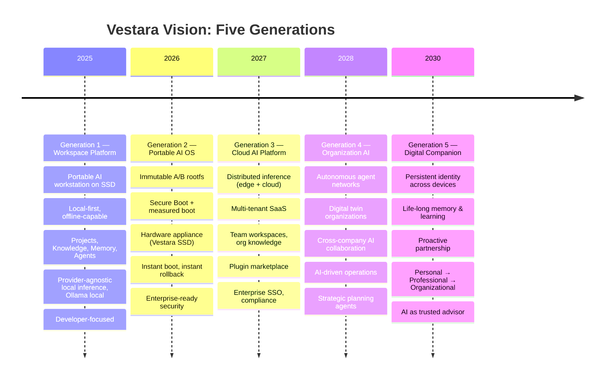

# Mission, Vision & Values

## Why Vestara Exists, Where It's Going, What It Stands For

---

## ═══════════════════════════════════════════════════════════════════

### 🎯 MISSION STATEMENT

### ═══════════════════════════════════════════════════════════════════

> **Vestara exists to empower people to create, build, learn, and lead by providing an AI companion that grows with them—from their first idea to running products, businesses, and organizations.**

### Mission Breakdown

| Element | Meaning |
| --------- | --------- |
| **Empower people** | Technology serves humans, not the reverse |
| **Create, build, learn, lead** | Full lifecycle: ideation → execution → mastery → leadership |
| **AI companion** | Not a tool, not a bot — a persistent partner |
| **Grows with them** | Longitudinal relationship, not session-based |
| **First idea to running organizations** | Scales from individual to enterprise |

---

## ═══════════════════════════════════════════════════════════════════

### 🔮 VISION: FIVE GENERATIONS

### ═══════════════════════════════════════════════════════════════════

### Vision Principles

1. **Each generation includes the previous** — Gen 2 runs Gen 1 workspaces; Gen 3 syncs Gen 1/2
2. **No lock-in** — Data portable at every layer (.vestara folder, open formats)
3. **Local-first always** — Cloud enhances, never replaces local capability
4. **Provider-agnostic** — Best model for the task, not vendor lock-in

---

## ═══════════════════════════════════════════════════════════════════

### 💎 CORE VALUES

### ═══════════════════════════════════════════════════════════════════

| Value | Description | In Practice |
| ------- | ------------- | ------------- |
| **Human Augmentation** | AI amplifies human capability, never replaces judgment | Agents propose, humans decide; no auto-commit |
| **Long-term Maintainability** | Code lasts 10+ years; optimize for reading, not writing | Strict TS, docs-first, ADRs, zero tech debt without ticket |
| **Modularity** | Loose coupling, high cohesion, replaceable modules | Feature-first, EventBus, provider-agnostic interfaces |
| **Offline-First** | Full functionality without internet | SQLite local, Ollama local, SSD boot, no required cloud |
| **Privacy-First** | User owns data; zero telemetry by default | No analytics, encrypted overlay, local AI options |
| **Provider-Agnostic** | OpenCode, Ollama, OpenAI, Anthropic, Google all equal | Abstract AIProvider interface, router selects best |
| **AI-Native Experiences** | AI is the interface, not a bolted-on feature | Chat-first UI, agents as primitives, natural language ops |
| **Enterprise-Grade Quality** | Security, observability, compliance built-in | Secure Boot, CSP, rate limits, audit logs, SBOM |
| **User Ownership** | Users own their data, models, agents, workflows | .vestara folder portable, export anytime, no vendor lock |
| **Open Ecosystem** | Plugins, providers, models, tools — all extensible | SDK, marketplace, open APIs, community governance |
| **Learning by Building** | Best way to learn is to create with AI | Templates, tutorials, guided projects, progressive disclosure |
| **Transparency** | Open about capabilities, limitations, data usage | Open source core, clear licensing, auditability |

---

## ═══════════════════════════════════════════════════════════════════

### 🏢 COMPANY STORY

### ═══════════════════════════════════════════════════════════════════

> **The Founder's Journey**

### The Problem Experienced

Building products for clients, I lived the frustration:

- Context switching between IDE, terminal, browser, chat, docs
- AI tools that forgot context between sessions
- Cloud dependencies that broke offline work
- Vendor lock-in to single AI providers
- No persistent memory across projects
- Security vs. convenience trade-offs

### Discovering AI

2022-2023: Early LLM experiments showed promise but were:

- Chat interfaces, not workspaces
- Stateless, no memory
- Cloud-only, privacy concerns
- Single-provider ecosystems

### Building an IDE

Attempted to build AI-first IDE (Vestara Code):

- Forked VS Code → maintenance burden
- Extension API limitations
- Still just an editor, not a platform
- Couldn't solve OS-level portability

### Creating Vestara

**The Insight**: The problem isn't the editor. It's the *environment*.

Vestara = **Portable AI Operating System**

- Boots from SSD on any x86-64 machine
- Complete AI workstation in 30 seconds
- Persistent memory, knowledge, agents
- Local-first, privacy-first, provider-agnostic
- Immutable OS with atomic updates

### The Name

**Vestara** — from *vest* (garment, portable) + *ara* (altar, sacred place)
> "Your portable sanctuary for creation"

---

## ═══════════════════════════════════════════════════════════════════

### 🎭 CULTURE PRINCIPLES

### ═══════════════════════════════════════════════════════════════════

| Principle | Behavior |
| ----------- | ---------- |
| **Blueprint First** | No code without spec; docs are the product |
| **Disagree and Commit** | Debate fiercely, decide, then execute together |
| **Own the Outcome** | Not "I shipped code" but "User succeeded" |
| **Ruthless Prioritization** | Say no to good ideas for great ones |
| **Default to Open** | Open source core, transparent roadmap |
| **Security is Everyone's Job** | Not a team — a mindset |
| **Measure What Matters** | User success metrics, not vanity metrics |
| **Continuous Learning** | Post-mortems without blame; Blueprint evolves |

---

## ═══════════════════════════════════════════════════════════════════

### 📏 SUCCESS METRICS (NORTH STAR)

### ═══════════════════════════════════════════════════════════════════

| Metric | Gen 1 Target | Gen 2 Target | Gen 3 Target |
| -------- | -------------- | -------------- | -------------- |
| **Boot to Productive** | <30 seconds | <15 seconds | N/A (cloud) |
| **Weekly Active Developers** | 1,000 | 10,000 | 100,000 |
| **Projects Created** | 10,000 | 100,000 | 1,000,000 |
| **AI Interactions/Day** | 100,000 | 1,000,000 | 10,000,000 |
| **Plugin/Provider Ecosystem** | 50 | 500 | 5,000 |
| **Enterprise Customers** | 0 | 50 | 500 |
| **Community Contributors** | 100 | 1,000 | 10,000 |

---

**END OF MISSION, VISION & VALUES**

*This document is the cultural constitution. Every decision traces back to these principles.*
