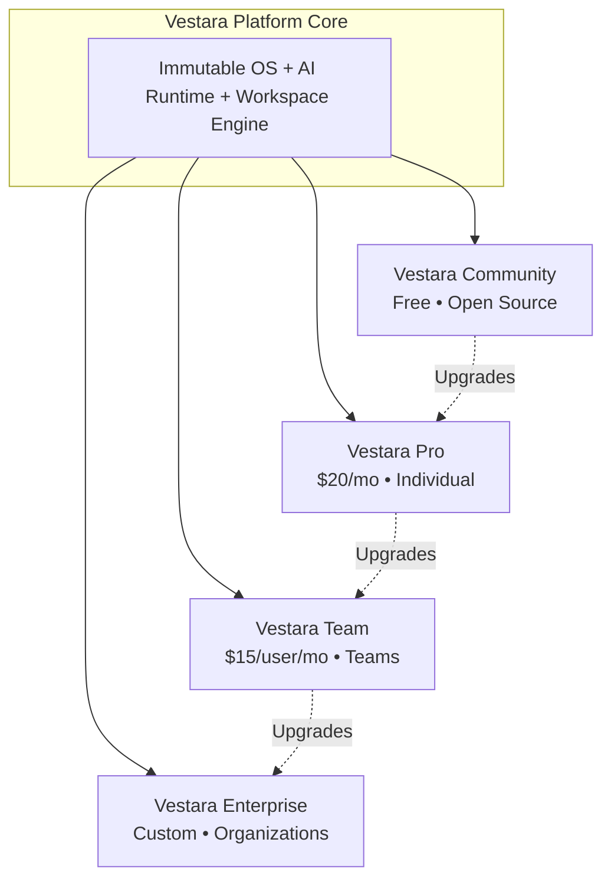
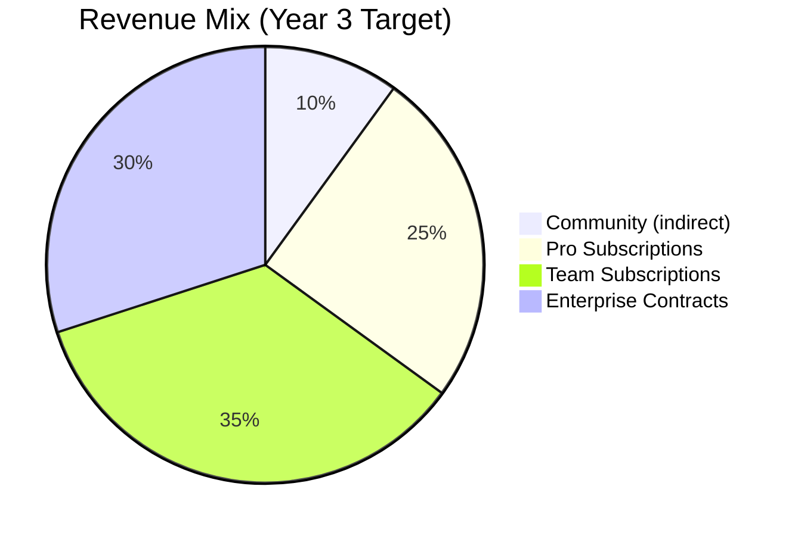

# Business Model
## Four Complementary Products, One Unified Platform

---

## ═══════════════════════════════════════════════════════════════════
### 🎯 PRODUCT PORTFOLIO STRATEGY
### ═══════════════════════════════════════════════════════════════════

Vestara evolves from a **single open-source product** (Gen 1) to a **four-tier product portfolio** (Gen 2+), each serving distinct user segments while sharing the same core platform.

---

## ═══════════════════════════════════════════════════════════════════
### 1. VESTARA COMMUNITY (FREE, OPEN SOURCE)
### ═══════════════════════════════════════════════════════════════════

**Target**: Individual developers, students, hobbyists, open source contributors

| Feature | Included |
|---------|----------|
| **Portable SSD Boot** | ✅ Full Gen 1 OS |
| **AI Workspace** | ✅ Projects, Knowledge, Memory |
| **Default AI Provider** | ✅ OpenCode (free models) |
| **Local AI** | ✅ Ollama integration |
| **Plugin Support** | ✅ Community plugins |
| **Learning Mode** | ✅ Guided tutorials, templates |
| **Source Code Access** | ✅ Full platform source |
| **Self-Hosted** | ✅ Run anywhere |
| **Community Support** | ✅ Discord, GitHub, forums |

**Limitations**:
- Single user only
- No cloud sync
- No premium AI models (OpenAI, Anthropic, Google)
- No advanced automation
- No analytics dashboard
- Community support only

**License**: Apache 2.0 (core), MIT (SDK)

---

### 2. VESTARA PRO ($20/month or $200/year)
### ═══════════════════════════════════════════════════════════════════

**Target**: Professional developers, indie hackers, power users

| Feature | Included |
|---------|----------|
| **Everything in Community** | ✅ |
| **Premium AI Providers** | ✅ OpenAI, Anthropic, Google |
| **Advanced Automation** | ✅ Workflows, scheduled agents |
| **Personal Knowledge Graph** | ✅ Cross-project memory, insights |
| **Voice Companion** | ✅ Voice input/output, TTS/STT |
| **Productivity Analytics** | ✅ Time tracking, focus metrics |
| **Priority Support** | ✅ Email, 24hr SLA |
| **Cloud Sync (Optional)** | ✅ Encrypted, user-controlled |
| **Custom Models** | ✅ Fine-tuned model support |

**Pricing Rationale**:
- $20/mo = ~1 premium API call/day value
- Annual discount = 2 months free
- No seat limits (individual use)

---

### 3. VESTARA TEAM ($15/user/month, min 3 users)
### ═══════════════════════════════════════════════════════════════════

**Target**: Startups, dev teams, agencies, research groups

| Feature | Included |
|---------|----------|
| **Everything in Pro** | ✅ Per user |
| **Shared Workspaces** | ✅ Real-time collaboration |
| **Team Knowledge Base** | ✅ Org-wide search, permissions |
| **Organization Agents** | ✅ Shared agent templates |
| **Project Collaboration** | ✅ Kanban, reviews, assignments |
| **Centralized Admin** | ✅ User management, billing |
| **SSO (SAML/OIDC)** | ✅ Okta, Azure AD, Google |
| **Audit Logs** | ✅ 90-day retention |
| **Priority Support** | ✅ Slack, 4hr SLA |

**Pricing Rationale**:
- Per-seat encourages adoption
- Team features unlock at 3+ users
- Volume discounts at 10+, 50+, 100+

---

### 4. VESTARA ENTERPRISE (Custom Pricing)
### ═══════════════════════════════════════════════════════════════════

**Target**: Enterprises, regulated industries, government, large orgs

| Feature | Included |
|---------|----------|
| **Everything in Team** | ✅ Unlimited users |
| **Self-Hosted Deployment** | ✅ Air-gapped, on-prem, VPC |
| **Private AI Infrastructure** | ✅ Dedicated GPUs, custom models |
| **Compliance & Auditing** | ✅ SOC2, HIPAA, GDPR, FedRAMP |
| **Enterprise Identity** | ✅ SCIM, advanced RBAC |
| **Custom AI Models** | ✅ Fine-tuning, RAG pipelines |
| **Dedicated Support** | ✅ TAM, 1hr SLA, on-site option |
| **SLA** | ✅ 99.9% uptime, penalties |
| **Professional Services** | ✅ Implementation, training |
| **Source Code Escrow** | ✅ Business continuity |

**Pricing**: Custom, typically $50-200/user/mo + infrastructure

---

## ═══════════════════════════════════════════════════════════════════
### 💰 REVENUE MODEL
### ═══════════════════════════════════════════════════════════════════

### Revenue Streams

| Stream | Model | Margin Target |
|--------|-------|---------------|
| **Pro Subscriptions** | Recurring SaaS | 85% |
| **Team Subscriptions** | Recurring SaaS | 80% |
| **Enterprise** | Annual contracts + services | 70% |
| **Marketplace (30% cut)** | Transaction fees | 90% |
| **Hardware (SSD/Appliance)** | One-time + subscription | 40% |
| **Professional Services** | Time & materials | 60% |
| **Training/Certification** | Per course/seat | 80% |

---

## ═══════════════════════════════════════════════════════════════════
### 📊 UNIT ECONOMICS (TARGETS)
### ═══════════════════════════════════════════════════════════════════

| Metric | Pro | Team | Enterprise |
|--------|-----|------|------------|
| **ARPU (Annual Revenue Per User)** | $200 | $180 | $1,200 |
| **CAC (Customer Acquisition Cost)** | $50 | $200 | $5,000 |
| **LTV (Lifetime Value)** | $600 | $1,800 | $50,000 |
| **LTV:CAC Ratio** | 12:1 | 9:1 | 10:1 |
| **Payback Period** | 3 months | 4 months | 6 months |
| **Gross Margin** | 85% | 80% | 70% |
| **Churn (Annual)** | 20% | 10% | 5% |
| **Net Revenue Retention** | 110% | 120% | 130% |

---

## ═══════════════════════════════════════════════════════════════════
### 🎯 GO-TO-MARKET STRATEGY
### ═══════════════════════════════════════════════════════════════════

### Phase 1: Community-Led (Gen 1, Year 1)
- Open source release → GitHub, Hacker News, Dev.to
- Discord community → Early adopters, contributors
- Content: Tutorials, streams, conference talks
- Goal: 10k stars, 1k active developers

### Phase 2: Pro Launch (Gen 1.5, Year 1.5)
- Premium AI providers + automation
- Influencer partnerships (dev YouTubers, newsletters)
- Product Hunt, Indie Hackers launch
- Goal: $10k MRR

### Phase 3: Team + Enterprise (Gen 2, Year 2)
- SSO, audit logs, admin console
- Direct sales for Enterprise
- Channel partners (MSPs, consultancies)
- Goal: $100k MRR

### Phase 4: Platform + Marketplace (Gen 3, Year 3)
- Plugin marketplace (30% revenue share)
- Certified providers, integrations
- Enterprise marketplace
- Goal: $1M MRR

---

## ═══════════════════════════════════════════════════════════════════
### 🏆 COMPETITIVE POSITIONING
### ═══════════════════════════════════════════════════════════════════

| Dimension | VS Code + Copilot | Cursor | Windsurf | **Vestara** |
|-----------|-------------------|--------|----------|-------------|
| **Portability** | ❌ Host-bound | ❌ Host-bound | ❌ Host-bound | ✅ SSD boot |
| **Offline AI** | ❌ | ❌ | ❌ | ✅ Ollama |
| **Memory/Knowledge** | ❌ | Limited | Limited | ✅ Persistent |
| **Agents** | ❌ | Basic | Basic | ✅ First-class |
| **Provider Choice** | GitHub only | Limited | Limited | ✅ All |
| **Privacy** | Telemetry | Telemetry | Telemetry | ✅ Zero default |
| **OS Integration** | None | None | None | ✅ Immutable OS |
| **Team Features** | GitHub Codespaces | Limited | Limited | ✅ Native |
| **Pricing** | $10-19/mo | $20/mo | $15-30/mo | **Free → $20** |

**Vestara Wins On**: Portability, Privacy, Provider Choice, Agent Architecture, OS Integration

---

## ═══════════════════════════════════════════════════════════════════
### 📈 FINANCIAL PROJECTIONS (3 YEAR)
### ═══════════════════════════════════════════════════════════════════

| Year | Users (Total) | Pro | Team | Enterprise | ARR | Team Size | Burn Rate |
|------|---------------|-----|------|------------|-----|-----------|-----------|
| **Year 1** | 10,000 | 500 | 50 | 0 | $150K | 5 | $200K/mo |
| **Year 2** | 50,000 | 3,000 | 500 | 10 | $1.2M | 15 | $400K/mo |
| **Year 3** | 200,000 | 15,000 | 3,000 | 50 | $8M | 40 | $800K/mo |

**Funding Needs**:
- Seed: $2M (18 months runway to Pro launch)
- Series A: $10M (Team + Enterprise + Gen 2 OS)
- Series B: $30M (Cloud platform + Global expansion)

---

**END OF BUSINESS MODEL**

*This model ensures Vestara remains accessible (free tier) while building sustainable revenue from users who need premium features, team collaboration, or enterprise guarantees.*
