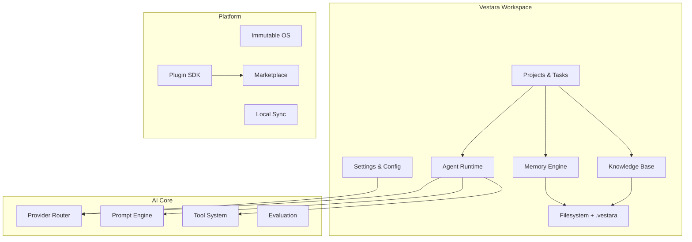
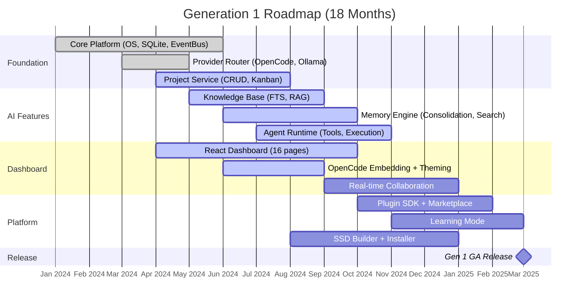

# Product Strategy
## How We Build the Right Thing, The Right Way

---

## ═══════════════════════════════════════════════════════════════════
### 🎯 PRODUCT POSITIONING
### ═══════════════════════════════════════════════════════════════════

**For**: Developers, builders, and creators who want AI as a persistent partner  
**Who**: Are frustrated by context-switching, vendor lock-in, and stateless AI tools  
**Vestara**: Is a portable AI operating system  
**That**: Boots from SSD, runs offline, remembers everything, works with any AI provider  
**Unlike**: VS Code + Copilot (host-bound, cloud-only, no memory) or Cursor (single-provider, no OS)  
**Our Promise**: "Your AI workstation on any computer — plug in, boot up, build."

---

## ═══════════════════════════════════════════════════════════════════
### 🏗️ PRODUCT FRAMEWORK: JOBS TO BE DONE
### ═══════════════════════════════════════════════════════════════════

| Job | Current Struggle | Vestara Solution |
|-----|------------------|------------------|
| **Start a new project** | Setup env, install deps, configure AI, create context | `vestara init` → instant AI-ready project |
| **Continue yesterday's work** | Re-explain context to AI, find files, restore mental model | Persistent memory + knowledge base + project state |
| **Work offline/on-the-go** | Cloud AI fails, no internet = no work | Local-first: Ollama + OpenCode free models |
| **Switch AI providers** | Locked into one vendor, different APIs | Unified provider router, model-agnostic |
| **Collaborate with team** | Share context via screenshots, lose AI history | Shared workspace + team knowledge + org agents |
| **Build AI-powered product** | Piece together LLM, vector DB, agents, prompts | Built-in agent runtime, RAG, tools, evaluation |
| **Learn by building** | Tutorials don't match real work | Learning mode: guided projects with AI mentor |
| **Stay secure/compliant** | Data leaves device, no audit trail | Local-first, encrypted, audit logs, self-hosted |

---

## ═══════════════════════════════════════════════════════════════════
### 📦 CORE MODULES (GEN 1)
### ═══════════════════════════════════════════════════════════════════

Each module is a **complete, shippable capability** with clear boundaries.

### Module Specifications

| Module | Purpose | Key Features | Gen 1 Scope |
|--------|---------|--------------|-------------|
| **Projects** | Organize work | CRUD, Kanban, tasks, sub-tasks, tags, time tracking, archive | ✅ Full |
| **Knowledge** | Persistent docs | Add, search (FTS), tag, version, embed, RAG | ✅ Full |
| **Memory** | Long-term recall | Facts, preferences, patterns, consolidation, importance scoring | ✅ Full |
| **Agents** | Autonomous work | Create, configure, execute, tools, streaming, persistence | ✅ Core |
| **Provider Router** | Model abstraction | OpenCode, Ollama, OpenAI, Anthropic, Google, fallback chains | ✅ Full |
| **Filesystem** | Project persistence | .vestara folder, SQLite, Git sync, portable | ✅ Full |
| **Settings** | Configuration | User, project, global, schema-validated, hot-reload | ✅ Full |
| **Plugin SDK** | Extensibility | TypeScript API, sandboxed, marketplace-ready | ✅ Core API |
| **Learning Mode** | Education | Guided projects, AI tutor, progress tracking | 🔄 MVP |

---

## ═══════════════════════════════════════════════════════════════════
### 🗺️ ROADMAP: GENERATION 1 (WORKSPACE PLATFORM)
### ═══════════════════════════════════════════════════════════════════

### Milestone Definitions

| Milestone | Date | Criteria |
|-----------|------|----------|
| **M1: Developer Preview** | 2024-06 | Core platform runs, OpenCode works, basic projects |
| **M2: Alpha** | 2024-09 | Knowledge + Memory + Agents functional, Dashboard usable |
| **M3: Beta** | 2024-12 | All Gen 1 modules complete, plugin SDK, SSD bootable |
| **M4: GA (Gen 1)** | 2025-03 | Stable, documented, tested, marketplace open, 1k users |

---

## ═══════════════════════════════════════════════════════════════════
### 🎪 FEATURE PRIORITIZATION FRAMEWORK
### ═══════════════════════════════════════════════════════════════════

Every feature scored on **RICE** (Reach × Impact × Confidence / Effort):

| Factor | Weight | Scale |
|--------|--------|-------|
| **Reach** | How many users affected? | 1-1000 (users/month) |
| **Impact** | How much does it improve core job? | 0.25 (minimal) - 3 (massive) |
| **Confidence** | How sure are we? | 0.1 (guess) - 1.0 (data) |
| **Effort** | Engineering weeks | 1-100 (person-weeks) |

**Threshold**: RICE > 500 = Prioritize; 100-500 = Backlog; <100 = Icebox

### Gen 1 Priority Features (High RICE)

| Feature | Reach | Impact | Conf | Effort | RICE | Status |
|---------|-------|--------|------|--------|------|--------|
| OpenCode default provider | 1000 | 3.0 | 1.0 | 2 | 1500 | ✅ Done |
| SQLite + .vestara folder | 1000 | 3.0 | 1.0 | 3 | 1000 | ✅ Done |
| Project Kanban board | 800 | 2.5 | 0.9 | 4 | 450 | 🔄 Active |
| Knowledge FTS search | 700 | 2.5 | 0.8 | 3 | 467 | 🔄 Active |
| Memory consolidation | 600 | 2.0 | 0.7 | 5 | 168 | 🔄 Active |
| Agent tool execution | 500 | 3.0 | 0.6 | 6 | 150 | 📋 Planned |
| Ollama on-demand | 400 | 2.0 | 0.9 | 2 | 360 | ✅ Done |
| Plugin SDK | 200 | 2.0 | 0.5 | 8 | 25 | 📋 Planned |

---

## ═══════════════════════════════════════════════════════════════════
### 🎨 USER EXPERIENCE PRINCIPLES
### ═══════════════════════════════════════════════════════════════════

| Principle | Implementation |
|-----------|----------------|
| **Instant Value** | Boot → Project → AI chat in <30 seconds |
| **Progressive Disclosure** | Simple by default, powerful on demand |
| **Keyboard-First** | Every action accessible via command palette |
| **Context Preservation** | Never lose state: memory, knowledge, scroll, cursor |
| **Provider Transparency** | Show which model, cost, latency for every response |
| **Offline Indicator** | Clear visual when online/offline, graceful degradation |
| **Learning Mode** | Optional guided tours, templates, AI mentor |
| **Accessibility** | WCAG 2.1 AA, screen readers, high contrast, reduced motion |

---

## ═══════════════════════════════════════════════════════════════════
### 📊 PRODUCT METRICS (OKRs)
### ═══════════════════════════════════════════════════════════════════

### Objective: Build the Best AI Workspace for Developers

| Key Result | Target | Measurement |
|------------|--------|-------------|
| **Weekly Active Developers** | 1,000 by GA | Unique users with ≥1 AI interaction/week |
| **Session Length** | >45 min median | Time from boot to shutdown |
| **AI Interactions/Session** | >20 median | Chat + agent executions |
| **Project Completion Rate** | >60% | Projects with ≥1 task moved to Done |
| **Provider Diversity** | >30% non-OpenCode | % sessions using Ollama/OpenAI/Anthropic |
| **Plugin Installs** | >5 avg/user | Community + official plugins |
| **NPS** | >50 | Quarterly survey |
| **Churn (Monthly)** | <5% | Active users lost/month |

---

**END OF PRODUCT STRATEGY**

*This framework ensures every feature traces to a real user job, is prioritized objectively, and measured rigorously.*
