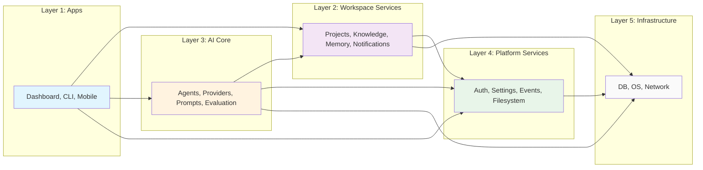

# Platform Architecture Overview
## The Complete Vestara Platform Structure

---

## ═══════════════════════════════════════════════════════════════════
### 🏗️ PLATFORM LAYERS
### ═══════════════════════════════════════════════════════════════════

```mermaid
graph TB
    subgraph "Applications"
        DASH[Dashboard<br/>React 19 + Vite 6]
        CLI[CLI<br/>@vestara/cli]
        MOBILE[Mobile Companion<br/>React Native]
    end
    
    subgraph "Workspace Services"
        PROJECTS[Project Service<br/>CRUD, Sync, Archive]
        KNOWLEDGE[Knowledge Service<br/>Documents, Search, RAG]
        MEMORY[Memory Service<br/>Consolidation, Search, Scoring]
        NOTIFICATIONS[Notification Service<br/>Activity, Alerts, Priorities]
    end
    
    subgraph "AI Core"
        AGENTS[Agent Runtime<br/>Creation, Execution, Tools]
        PROVIDERS[Provider Manager<br/>OpenCode, Ollama, OpenAI, Anthropic, Google]
        PROMPTS[Prompt Engine<br/>Templates, Optimization, Versioning]
        EVAL[Evaluation Engine<br/>Benchmarks, Regression, A/B]
    end
    
    subgraph "Platform Services"
        AUTH[Auth Service<br/>OS Login, JWT, Roles]
        SETTINGS[Settings Service<br/>Key-Value, Scoped]
        EVENTS[Event Bus<br/>Pub/Sub, Typed Events]
        FILESYSTEM[Filesystem Service<br/>.vestara, Watch, Sync]
    end
    
    subgraph "Infrastructure"
        DB[(SQLite<br/>better-sqlite3)]
        OS[Immutable OS<br/>A/B, Secure Boot, LUKS2]
        NETWORK[Network Stack<br/>mDNS, WireGuard, Local-First]
    end
    
    DASH --> PROJECTS
    DASH --> KNOWLEDGE
    DASH --> MEMORY
    DASH --> AGENTS
    DASH --> AUTH
    DASH --> SETTINGS
    
    CLI --> PROJECTS
    CLI --> KNOWLEDGE
    CLI --> AGENTS
    
    PROJECTS --> DB
    KNOWLEDGE --> DB
    MEMORY --> DB
    NOTIFICATIONS --> DB
    SETTINGS --> DB
    AUTH --> DB
    
    AGENTS --> PROVIDERS
    AGENTS --> PROMPTS
    AGENTS --> EVENTS
    AGENTS --> MEMORY
    AGENTS --> KNOWLEDGE
    AGENTS --> FILESYSTEM
    
    PROVIDERS --> OS
    FILESYSTEM --> OS
    EVENTS --> OS
```

---

## ═══════════════════════════════════════════════════════════════════
### 📦 MODULE REGISTRY
### ═══════════════════════════════════════════════════════════════════

| Module | Package | Responsibility | Dependencies |
|--------|---------|----------------|--------------|
| **Auth** | `@vestara/core` | OS login, JWT, roles | `db`, `events` |
| **Projects** | `@vestara/core` | CRUD, sync, archive, analytics | `db`, `events`, `fs`, `memory`, `knowledge` |
| **Knowledge** | `@vestara/core` | Documents, FTS, RAG, embeddings | `db`, `events`, `providers` |
| **Memory** | `@vestara/memory` | Consolidation, search, scoring | `db`, `events`, `providers` |
| **Notifications** | `@vestara/notifications` | Activity log, in-app, priorities | `db`, `events` |
| **Settings** | `@vestara/core` | Scoped key-value config | `db` |
| **Agent Runtime** | `@vestara/agents` | Agent lifecycle, tools, execution | `db`, `events`, `providers`, `memory`, `knowledge`, `fs` |
| **Provider Manager** | `@vestara/agents` | Multi-provider routing, fallback | `providers` (external) |
| **Prompt Engine** | `@vestara/agents` | Templates, versioning, optimization | `db`, `events` |
| **Evaluation** | `@vestara/agents` | Benchmarks, regression, A/B | `db`, `events`, `providers` |
| **Filesystem** | `@vestara/core` | .vestara ops, watch, sync | `db`, `events`, `os` |
| **Event Bus** | `@vestara/core` | Typed pub/sub, in-process | — |

---

## ═══════════════════════════════════════════════════════════════════
### 🔗 DEPENDENCY RULES
### ═══════════════════════════════════════════════════════════════════



### Dependency Constraints

| Rule | Enforcement |
|------|-------------|
| **Apps** may depend on any layer | ESLint: `no-restricted-imports` |
| **Workspace Services** may depend on Platform + Infra | ESLint |
| **AI Core** may depend on Workspace + Platform + Infra | ESLint |
| **Platform Services** may depend only on Infra | ESLint |
| **NO circular dependencies** | `madge --circular` in CI |
| **NO direct DB access** outside owning service | TypeScript: `private db` |
| **Cross-service via Events only** | Architecture review |

---

## ═══════════════════════════════════════════════════════════════════
### 🌐 API SURFACE
### ═══════════════════════════════════════════════════════════════════

### REST API (Fastify, `/api/v1`)

| Endpoint | Service | Auth | Description |
|----------|---------|------|-------------|
| `GET /health` | System | Public | Health check |
| `GET /system/info` | System | Public | Version, build, OS |
| `POST /auth/os-login` | Auth | Public | OS username/password |
| `POST /auth/os-auto-login` | Auth | Public | Detect current OS user |
| `GET /auth/me` | Auth | Required | Current user |
| `DELETE /auth/logout` | Auth | Required | Invalidate session |
| `GET /projects` | Projects | Required | List projects |
| `POST /projects` | Projects | Required | Create project |
| `GET /projects/:id` | Projects | Required | Get project |
| `PATCH /projects/:id` | Projects | Required | Update project |
| `DELETE /projects/:id` | Projects | Required | Delete project |
| `POST /projects/:id/archive` | Projects | Required | Archive to .vestara |
| `POST /projects/:id/clone` | Projects | Required | Clone project |
| `GET /projects/:id/tasks` | Projects | Required | List tasks (with filters) |
| `POST /projects/:id/tasks` | Projects | Required | Create task |
| `PATCH /projects/:id/tasks/:taskId` | Projects | Required | Update task |
| `POST /projects/:id/tasks/bulk` | Projects | Required | Bulk update tasks |
| `GET /projects/:id/activity` | Projects | Required | Activity timeline |
| `GET /knowledge` | Knowledge | Required | Search knowledge |
| `POST /knowledge` | Knowledge | Required | Add knowledge |
| `GET /knowledge/:id` | Knowledge | Required | Get knowledge entry |
| `DELETE /knowledge/:id` | Knowledge | Required | Delete knowledge |
| `GET /memory/search` | Memory | Required | Search memories |
| `POST /memory` | Memory | Required | Add memory |
| `GET /notifications` | Notifications | Required | List notifications |
| `PATCH /notifications/:id/read` | Notifications | Required | Mark read |
| `GET /agents` | Agents | Required | List agents |
| `POST /agents` | Agents | Required | Create agent |
| `POST /agents/:id/execute` | Agents | Required | Execute agent |
| `GET /providers` | Providers | Required | List AI providers |
| `GET /providers/models` | Providers | Required | List available models |
| `POST /providers/opencode/start` | Providers | Public | Start OpenCode server |
| `GET /settings` | Settings | Required | Get all settings |
| `PATCH /settings/:key` | Settings | Required | Update setting |

### WebSocket (`/ws`)

| Event | Direction | Payload |
|-------|-----------|---------|
| `auth:challenge` | Server → Client | `{ nonce }` |
| `auth:response` | Client → Server | `{ signature }` |
| `auth:success` | Server → Client | `{ user, token }` |
| `project:updated` | Server → Client | `{ projectId, changes }` |
| `task:updated` | Server → Client | `{ taskId, changes }` |
| `agent:progress` | Server → Client | `{ agentId, step, output }` |
| `agent:complete` | Server → Client | `{ agentId, result }` |
| `notification:new` | Server → Client | `{ notification }` |
| `sync:progress` | Server → Client | `{ projectId, phase, progress }` |

### Internal Service APIs (TypeScript Interfaces)

Each service exports typed interfaces from `@vestara/types`:

```typescript
// packages/types/src/services.ts
export interface ProjectService {
  createProject(userId: string, input: CreateProjectInput): Promise<Project>;
  getProject(id: string): Promise<Project | null>;
  getProjects(userId: string, filter?: ProjectFilter): Promise<Project[]>;
  updateProject(id: string, input: UpdateProjectInput): Promise<Project>;
  deleteProject(id: string): Promise<void>;
  archiveProject(id: string, userId: string): Promise<void>;
  cloneProject(id: string, userId: string, options: CloneOptions): Promise<Project>;
  // Tasks
  createTask(projectId: string, userId: string, input: CreateTaskInput): Promise<Task>;
  getTasks(projectId: string, filter?: TaskFilter): Promise<Task[]>;
  updateTask(id: string, input: UpdateTaskInput): Promise<Task>;
  bulkUpdateTasks(projectId: string, ids: string[], input: BulkUpdateInput): Promise<Task[]>;
  getSubTasks(projectId: string, parentId: string): Promise<Task[]>;
  // Activity
  logActivity(userId: string, action: string, resource: string, metadata?: Record<string, unknown>): Promise<void>;
  getProjectActivity(projectId: string, limit?: number): Promise<Activity[]>;
}
```

---

## ═══════════════════════════════════════════════════════════════════
### 🔄 DATA FLOW PATTERNS
### ═══════════════════════════════════════════════════════════════════

### Pattern 1: Request-Response (Sync)
```
Client → Fastify Route → Service Method → DB → Response
```
- Used for: CRUD, queries, mutations
- Timeout: 30s default
- Validation: Zod at route boundary

### Pattern 2: Event-Driven (Async)
```
Service A → EventBus.emit('domain:action', payload)
                ↓
        [EventBus distributes to subscribers]
                ↓
Service B → on('domain:action', handler) → Side effect
```
- Used for: Cross-service notifications, indexing, sync, analytics
- At-least-once delivery (in-process)
- Typed events via `EventMap` interface

### Pattern 3: Streaming (AI Responses)
```
Client → POST /agents/:id/execute → AgentRuntime.execute()
                ↓
        AgentRuntime → Provider.stream() → AsyncIterable<Chunk>
                ↓
        Fastify reply → chunked transfer encoding → Client
```
- Used for: LLM streaming, agent execution progress
- Cancellation via AbortSignal
- Backpressure handled by Fastify

### Pattern 4: Background Jobs (Scheduled)
```
Scheduler (setInterval) → Service.method() → DB + Events
```
- Used for: Memory consolidation, knowledge indexing, cleanup
- Runs in same process (no separate queue needed for Gen 1)
- Gen 3: Migrate to Redis/BullMQ

---

## ═══════════════════════════════════════════════════════════════════
### 🛡️ SECURITY BOUNDARIES
### ═══════════════════════════════════════════════════════════════════

| Boundary | Protection |
|----------|------------|
| **Network → API** | Rate limiting (100/min), CSP, CORS, Helmet |
| **API → Services** | JWT validation, role check, input validation (Zod) |
| **Service → DB** | Parameterized queries, typed results, row-level security |
| **Service → AI Providers** | API key rotation, request/response logging, cost limits |
| **Service → Filesystem** | Path traversal protection, `.vestara/` sandbox |
| **Inter-Service** | EventBus with typed payloads, no direct calls |
| **OS → Hardware** | Secure Boot, dm-verity, LUKS2, TPM2 |

---

## ═══════════════════════════════════════════════════════════════════
### 📈 SCALABILITY ROADMAP
### ═══════════════════════════════════════════════════════════════════

| Generation | Architecture | Scale Target |
|------------|--------------|--------------|
| **Gen 1** | Single-process, SQLite, in-process EventBus | 1 user, 10k projects, 1M memories |
| **Gen 2** | Same + Immutable OS, verified boot | 1 user, portable hardware |
| **Gen 3** | Multi-process, Redis, PostgreSQL, gRPC | 10k users, multi-tenant, cloud |
| **Gen 4** | Distributed agents, message queues, event sourcing | 1M users, org-level |
| **Gen 5** | Global federation, edge inference, personal AI cloud | Billions of interactions |

---

**END OF PLATFORM OVERVIEW**

*This document is the architectural map. Every service, API, and data flow traces to this structure.*
