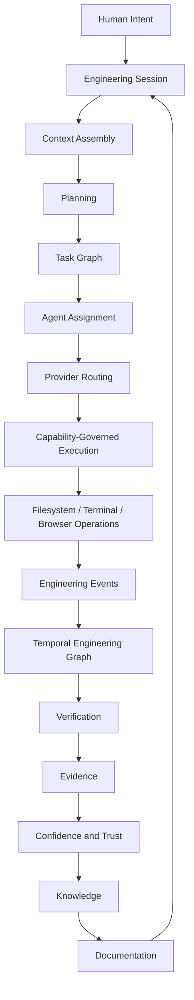

# Engineering Operating System

## Purpose

Describe the current Vestara direction as an **engineering operating system**:
a runtime that hosts, coordinates, and governs AI-driven engineering work inside
a repository workspace. This document replaces the earlier service-oriented
framing as the canonical architecture for how the Workspace composes its
subsystems and executes intent.

## Context

Earlier Blueprint volumes described a service-oriented platform. The implemented
runtime (`vestara-ai-core`) is an operating-system-style kernel with a workspace
runtime that composes specialists, an agent runtime, a capability-governed
execution layer, and an event-sourced engineering graph. This document
reconciles the architecture with that implementation.

## Current state

- **Implemented and verified**: `WorkspaceRuntime` composition, lifecycle state
  machine, `AgentRuntime`, filesystem capability manager, telemetry, verification
  pipeline, Engineering Graph, and the Engineering Event Store.
- **Implemented**: provider-neutral routing intent, versioned routing selection,
  governed task assignment, API/CLI/Workspace UI routing surfaces, and an Ink
  Console using shared runtime transport.
- **Partially implemented**: cross-provider execution (single provider wired).
- **Specified only / proposed**: Marketplace, extension platform, durable event
  persistence, historical confidence.

## Central lifecycle

The implemented workflow coordinator follows this lifecycle. Every stage has an
owner; intent flows downward, evidence flows upward.

## Runtime composition

The kernel (`@vestara/kernel`) orchestrates boot; `WorkspaceRuntime`
(`@vestara/workspace`) composes and hosts the workspace subsystems.

| Boundary | Implemented owner |
|----------|-------------------|
| WorkspaceRuntime | Composes and hosts workspace subsystems (`WorkspaceRuntime.open()`) |
| Engineering workflow coordinator | Session orchestrator + planning/implementation/verification services |
| AgentRuntime | Runs agents (`agent-runtime`, `agent-storage`, telemetry states) |
| Provider layer | Executes provider-specific intelligence (`@vestara/provider-runtime`, default provider) |
| VerificationRuntime | Evaluates claims and evidence (verification pipeline, evidence pipeline) |
| EngineeringEventStore | Stores historical engineering truth (session-only today) |
| EngineeringGraph | Projects structural and temporal engineering state |

Every `Runtime` instance uses `@vestara/state-machine` for lifecycle transitions
(`created → initializing → running → stopped → …`). The state machine is
zero-dependency and generic.

## Engineering objects

The runtime models these first-class objects. Implemented objects use the
implementation's actual identifiers.

| Object | Identifier | Owner | Implemented |
|--------|-----------|-------|-------------|
| Workspace | session fingerprint (`fingerprint.id`) | WorkspaceRuntime | yes |
| Repository | `repository://<name>` graph node | Engineering Graph | yes |
| Intent | execution session `goal` | SessionOrchestrator | yes |
| Plan | `plan://<id>` / PlanStorage | PlanningService | yes |
| Task | `task://<plan>:<task>` | PlanStorage | yes |
| Execution | `execution://<id>` | AgentRuntime | yes |
| Session | `session://<id>` | SessionStorage | yes |
| Agent | `agent://<id>` | AgentRuntime / AgentStorage | yes |
| Provider | provider-scoped model refs in `@vestara/provider-runtime` | ProviderRuntime | routing implemented; one default wired |
| Capability | capability manifest + manager | AgentCapabilityManager | yes |
| Approval | collaboration records + session approvals | CollaborationService | yes |
| Artifact | change sets, verification reports, reviews | storages | yes |
| Verification | `verification://<id>` | VerificationRuntime | yes |
| Evidence | verification report + telemetry + screenshots | Verification pipeline | partial |
| Engineering Event | `GraphEvent` (seq, at, type) | EngineeringEventStore | yes |
| Graph Entity / Relationship | `kind://id` / directed edges | Engineering Graph | yes |
| Checkpoint | `GraphSnapshot` | EngineeringEventStore | yes |
| Confidence | — | — | proposed |
| Trust | — | — | proposed |
| Knowledge | knowledge graph (`@vestara/knowledge`) | Understanding | yes |
| Module / Plugin | — | Extension platform | proposed |

## Responsibilities and boundaries

- **WorkspaceRuntime** owns workspace identity, fingerprinting, understanding,
  and indexing.
- **Engineering workflow coordinator** owns intent → plan → task → assignment →
  execution → verification → completion.
- **AgentRuntime** owns agent lifecycle, task execution, and capability use.
- **Provider layer** owns provider-specific reasoning only; it never owns intent,
  permissions, evidence, or history.
- **VerificationRuntime** owns claims, checks, and evidence aggregation.
- **EngineeringEventStore** owns historical truth.
- **EngineeringGraph** owns the derived projection.

## Events

Engineering events are first-class: `entity-created | entity-updated |
entity-deleted | relationship-added | relationship-removed`, with monotonic
sequence numbers and ISO timestamps. See
[`engineering-event-architecture`](engineering-event-architecture.md).

## Security

Execution is governed by capability declarations and an approval gate
(`AgentCapabilityManager`). The effective permission model is workspace policy
intersected with participant, role, task, provider capability, and user approval.
The full intersection model is implemented incrementally; capability-based
checks and approval gates are implemented today.

## Evidence and verification

Verification produces evidence (reports, telemetry, screenshots) consumed by
decisions. Visual and screenshot verification is implemented and verified
(see `14-engineering/visual-verification.md`). Historical confidence is proposed.

## Failure behavior

Runtimes degrade gracefully: state machine failure states, verification retries,
and capability denials are surfaced as events. Missing providers/binaries degrade
to "not available" rather than throwing.

Routing health uses hysteresis and explicit degraded, unavailable, cooldown,
authentication-required, and rate-limited states. Automatic fallback is allowed
only at policy-declared stages. After filesystem or command side effects,
execution pauses and reassignment requires explicit approval.

## Trade-offs

- **Monorepo, one runtime**: rapid composition; the workspace is a single
  integration hub (`@vestara/workspace`).
- **Event-sourced graph**: strong temporal reconstruction; session-only
  persistence today is the principal limitation.

## Implementation status

Implemented and verified in `vestara-ai-core` (local main). Verification
evidence: package tests, API smoke tests, and the visual-regression run
(see the capability maturity matrix).

## Future direction

Additional provider adapters, provider-independent verification, durable event
persistence, historical confidence, extension platform, and the Marketplace. See
`20-roadmaps/engineering-os-roadmap.md`.

## Related ADRs

- `adr/ADR-104-evidence-based-verification.md`
- `adr/ADR-105-event-sourced-engineering-graph.md`
- `adr/ADR-106-provider-neutral-engineering-provider-runtime.md`

## Related implementation

- Repository: `evillan0315/vestara-ai-core`
- Paths: `packages/workspace/src`, `packages/kernel/src`, `packages/agent-runtime`
  (agent storage/runtime), `packages/engineering-graph/src`,
  `packages/provider-runtime/src`, `apps/api/src/routes`, `apps/console/src`
