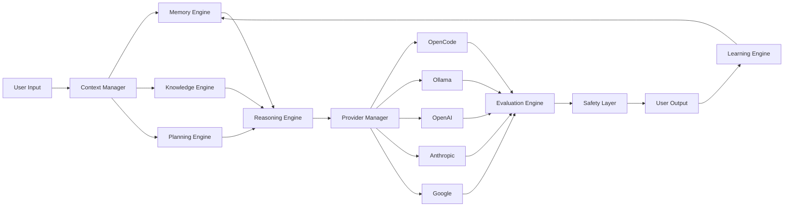

# AI Architecture Overview
## The Brain of Vestara — Every AI Subsystem

> **The AI Core is the heart of Vestara. Every intelligence capability — conversation, memory, reasoning, planning, knowledge, agents, providers — is a subsystem within this architecture. They compose like LEGO blocks to create any AI experience.**

---

## ═══════════════════════════════════════════════════════════════════
### 🧠 AI PIPELINE
### ═══════════════════════════════════════════════════════════════════



---

## ═══════════════════════════════════════════════════════════════════
### 🔄 AI SUBSYSTEMS DETAIL
### ═════════════════────────────────────────────────────────────────────

### 1. Conversation Engine
**Purpose**: Multi-turn dialogue with context, memory, tool use, and streaming.

| Capability | Gen 1 | Gen 2 | Gen 3+ |
|------------|-------|-------|--------|
| Multi-turn chat | ✅ | ✅ | ✅ |
| Context management | ✅ | ✅ | ✅ |
| Streaming responses | ✅ | ✅ | ✅ |
| Tool/function calling | ✅ | ✅ | ✅ |
| Multi-modal input | ❌ | ✅ | ✅ |
| Proactive suggestions | ❌ | 🔄 | ✅ |
| Voice conversation | 🔄 | ✅ | ✅ |

**Components**: Session manager, context window optimizer, tool parser, stream handler

---

### 2. Memory Engine
**Purpose**: Persistent memory across sessions with automatic consolidation and importance scoring.

**Memory Layers**:
```
Permanent Memory
  • Mission, vision, architecture, standards
  • Never consolidated away
  • Loaded at system initialization

Project Memory
  • Repository context, roadmap, milestones, decisions
  • Scoped to active project
  • Persisted in .vestara/memory/

Session Memory
  • Current conversation context
  • Temporary working state
  • Evicted when session ends

Execution Memory
  • Files, code, logs, outputs
  • Ephemeral per execution
  • Retained for debugging
```

| Capability | Gen 1 | Gen 2 | Gen 3+ |
|------------|-------|-------|--------|
| Fact memory | ✅ | ✅ | ✅ |
| Preference memory | ✅ | ✅ | ✅ |
| Memory search | ✅ | ✅ | ✅ |
| Automatic consolidation | ✅ | ✅ | ✅ |
| Importance scoring | ✅ | ✅ | ✅ |
| Episodic memory | 🔄 | ✅ | ✅ |
| Cross-project memory | 🔄 | ✅ | ✅ |
| Multi-user memory | ❌ | 🔄 | ✅ |

**Components**: Memory store, consolidation scheduler, scoring algorithm, search index (FTS + vector)

---

### 3. Knowledge Engine (RAG)
**Purpose**: Document storage, search, and retrieval-augmented generation.

| Capability | Gen 1 | Gen 2 | Gen 3+ |
|------------|-------|-------|--------|
| FTS search | ✅ | ✅ | ✅ |
| Vector search | 🔄 | ✅ | ✅ |
| Hybrid search | 🔄 | ✅ | ✅ |
| Document management | ✅ | ✅ | ✅ |
| RAG pipeline | ✅ | ✅ | ✅ |
| Knowledge graph | ❌ | 🔄 | ✅ |
| Automatic indexing | 🔄 | ✅ | ✅ |

**Components**: Document store, FTS index (FTS5), vector index (sqlite-vec), embedder, retriever, reranker

---

### 4. Provider Manager
**Purpose**: Abstract interface over all AI providers with routing, fallback, and cost tracking.

```typescript
interface AIProvider {
  readonly id: string;
  readonly models: Model[];
  complete(request: CompletionRequest): Promise<CompletionResponse>;
  stream(request: CompletionRequest): AsyncIterable<StreamChunk>;
  countTokens(text: string): number;
  estimateCost(prompt: string, completion: string): Cost;
}
```

**Provider Priority Chain** (configurable):
```
opencode/ → ollama/ → openai/ → anthropic/ → google/
```

**Provider States**:
| State | Meaning | User Visible |
|-------|---------|--------------|
| `available` | Ready to serve | ✅ Active in list |
| `degraded` | High latency, rate limited | ⚠️ Warning badge |
| `unavailable` | API key missing, service down | ❌ Grayed out |
| `loading` | Starting up (Ollama on-demand) | 🔄 Spinner |

**Fallback Strategy**:
1. Try primary provider
2. On failure: log error, try next in chain
3. On success: return to primary for next request
4. Track failure rates for smart routing (Gen 3)

---

### 5. Agent Runtime
**Purpose**: Create, execute, and manage AI agents with tools, memory, and persistence.

```mermaid
graph TB
    USER[User] --> CREATE[createAgent{config}]
    CREATE --> AGENT[Agent Instance]
    
    USER --> EXECUTE[executeAgent{task}]
    EXECUTE --> AGENT
    
    AGENT --> TOOLS[Tool Registry]
    AGENT --> MEMORY[Memory]
    AGENT --> KNOWLEDGE[Knowledge]
    AGENT --> PROVIDER[AI Provider]
    
    TOOLS --> FS[Filesystem]
    TOOLS --> WEB[Web Search]
    TOOLS --> CODE[Code Execution]
    TOOLS --> CUSTOM[Custom Plugins]
    
    AGENT --> STREAM[Streaming Result]
    STREAM --> USER
```

**Agent Lifecycle**:
```
Created → Idle → Executing → Paused → Completed/Failed → Archived
                                  ↓
                             (Resumed)
```

**Built-in Tools** (Gen 1):
- `read_file(path)` — Read file contents
- `write_file(path, content)` — Write file
- `search_knowledge(query)` — Search knowledge base
- `search_memory(query)` — Search memory
- `execute_command(command)` — Sandboxed shell
- `web_search(query)` — Web search (if connected)
- `create_task(project, title, description)` — Create task

---

### 6. Evaluation Engine
**Purpose**: Evaluate AI outputs for quality, safety, regression, and performance.

| Evaluation Type | When | Metrics |
|----------------|------|---------|
| **Quality** | Every response | Relevance, coherence, accuracy |
| **Safety** | Every response | Toxicity, PII, prompt injection |
| **Regression** | After model/provider change | Benchmark score delta |
| **Performance** | Continuous | Latency p50/p95/p99, token/s, cost |

---

### 7. Safety Layer
**Purpose**: Prevent harmful outputs, protect user privacy, enforce boundaries.

| Guard | Implementation |
|-------|----------------|
| Content filtering | Block toxic, hateful, dangerous content |
| PII detection | Redact emails, phone, SSN, keys |
| Prompt injection | Detect and neutralize injection attempts |
| Rate limiting | Prevent abuse, cost control |
| Data boundaries | Prevent exfiltration of user data |
| Tool permissions | Ask before executing consequential actions |

---

## ═══════════════════════════════════════════════════════════════════
### 🎯 AI MEMORY LAYERS (DETAILED)
### ═══════════════════════════════════════════════════════════════════

```
Layer 0: Constitutional Memory (Permanent)
━━━━━━━━━━━━━━━━━━━━━━━━━━━━━━━━━━━━━━━
Stored in: VESTARA_CONSTITUTION.md, AI_CONSTITUTION.md
Persistence: Permanent, never consolidated
Content: Mission, vision, core principles, architecture, standards
Access: Loaded at system init, always available

Layer 1: Platform Memory (Long-term)
━━━━━━━━━━━━━━━━━━━━━━━━━━━━━━━━━━━━━━━
Stored in: .vestara/memory/, SQLite
Persistence: Months to years
Content: User preferences, learned patterns, project context
Access: Summary loaded at session start; full search on demand

Layer 2: Session Memory (Short-term)
━━━━━━━━━━━━━━━━━━━━━━━━━━━━━━━━━━━━━━━
Stored in: In-memory (volatile)
Persistence: Duration of session
Content: Current conversation, temporary state, working context
Access: Full context available during session

Layer 3: Execution Memory (Ephemeral)
━━━━━━━━━━━━━━━━━━━━━━━━━━━━━━━━━━━━━━━
Stored in: In-memory (volatile, per execution)
Persistence: Duration of agent execution
Content: Files, code, logs, outputs, intermediate states
Access: Available during execution; summarized into session memory on completion
```

**Consolidation Strategy**:
- Every N interactions (configurable, default 50), run consolidation
- Low-importance memories are summarized coarser
- High-importance memories maintained at full resolution
- Sessions older than 30 days are archived into monthly summaries

---

## ═══════════════════════════════════════════════════════════════════
### 🔗 CROSS-REFERENCES
### ═══════════════════════════════════════════════════════════════════

| Document | Relationship |
|----------|--------------|
| `AI_CONSTITUTION.md` | AI behavior governance |
| `AI_INSTRUCTION.md` | Master prompt for all AI agents |
| `04-platform/` | Platform services that AI consumes |
| `06-workspace/` | UI that presents AI capabilities |
| `12-data/` | Memory and knowledge storage |
| `21-research/` | AI research that feeds into improvements |

---

**END OF AI ARCHITECTURE OVERVIEW**

*The AI Core is not a single model or provider. It is a system of systems that compose to create intelligence.*
