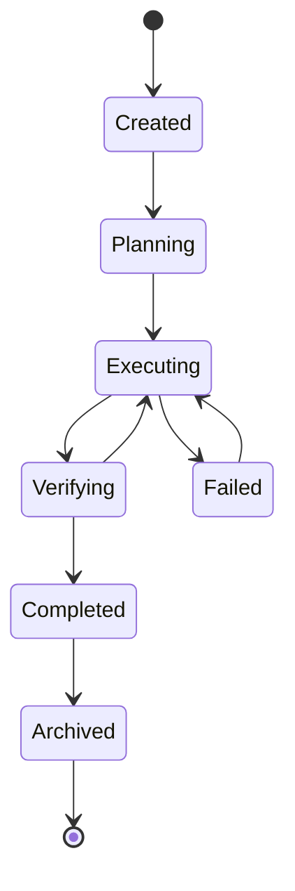
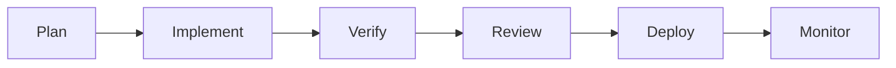
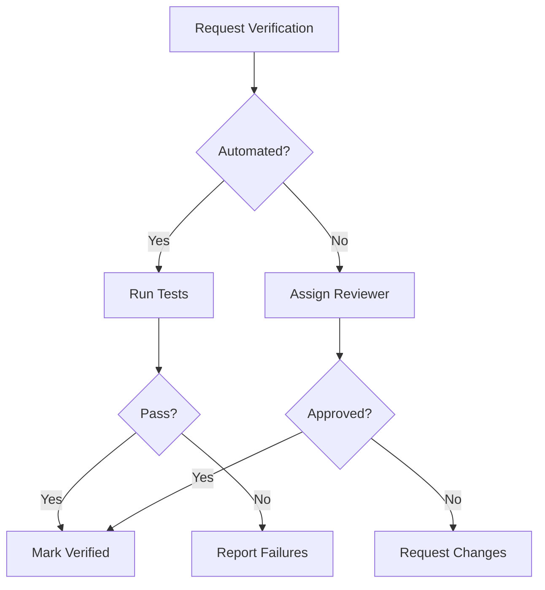

# Workspace UI/UX Implementation

## Complete Engineering Experience Specification

> **This is the canonical specification for the entire Vestara Engineering Workspace.**
> Every future Workspace implementation — web, desktop, terminal, mobile — follows this document.

---

## Table of Contents

1. [Workspace Philosophy](#1-workspace-philosophy)
2. [Engineering Session Model](#2-engineering-session-model)
3. [Workspace Layout](#3-workspace-layout)
4. [Navigation](#4-navigation)
5. [Command Palette](#5-command-palette)
6. [Search](#6-search)
7. [Shortcuts](#7-shortcuts)
8. [Dashboard](#8-dashboard)
9. [Operations Center](#9-operations-center)
10. [Agent Workspace](#10-agent-workspace)
11. [Execution Pipeline](#11-execution-pipeline)
12. [Engineering Graph](#12-engineering-graph)
13. [Evidence Center](#13-evidence-center)
14. [Verification Center](#14-verification-center)
15. [Inspector System](#15-inspector-system)
16. [Timeline](#16-timeline)
17. [Telemetry](#17-telemetry)
18. [Runtime](#18-runtime)
19. [Explorer](#19-explorer)
20. [Knowledge](#20-knowledge)
21. [Artifacts](#21-artifacts)
22. [Collaboration](#22-collaboration)
23. [Terminal](#23-terminal)
24. [Chat](#24-chat)
25. [Workspace Modes](#25-workspace-modes)
26. [Responsive Design](#26-responsive-design)
27. [Accessibility](#27-accessibility)
28. [Motion System](#28-motion-system)
29. [UX Principles](#29-ux-principles)
30. [Future Workspace Vision](#30-future-workspace-vision)

---

## 1. Workspace Philosophy

### 1.1 The Engineering Operating System

Vestara is not an IDE. It is not a chatbot. It is not an agent framework.
It is an **Engineering Operating System** — a complete environment where engineering work happens.

The Workspace is the human interface to this operating system. It is where engineers, architects, product managers, and stakeholders interact with the engineering process.

### 1.2 Core Beliefs

| Belief | Implication |
|--------|-------------|
| **Every engineering action is observable** | No hidden state, no silent operations |
| **Every AI decision produces evidence** | Explainability is mandatory, not optional |
| **Every artifact is traceable** | Lineage from requirement to deployment |
| **Every execution is replayable** | Time-travel debugging for AI agents |
| **Every entity is inspectable** | Click any object to understand its state |
| **Every relationship is navigable** | Graph-based exploration, not file trees |
| **Every workflow is deterministic** | Same inputs → same outputs |
| **Every state transition is visible** | Audit trail for all changes |

### 1.3 The Engineering Session

Everything in the workspace revolves around a single object: the **Engineering Session**.

An Engineering Session is:
- A bounded context for engineering work
- A container for plans, agents, workflows, executions, evidence, artifacts
- A timeline of all activity
- A graph of all relationships
- A source of truth for all state

```
Engineering Session
├── Plan
├── Agents
├── Workflow
├── Executions
├── Evidence
├── Artifacts
├── Timeline
├── Repository
├── Knowledge Graph
├── Verification
├── Runtime
└── Activity
```

### 1.4 User-Centered Design

The workspace adapts to the user, not the other way around.

| User Role | Primary Focus | Workspace Mode |
|-----------|---------------|----------------|
| Executive | Milestones, progress, KPIs, risks | Executive |
| Architect | System topology, dependencies, ADRs | Architect |
| Developer | Repository, terminal, implementations, diffs | Developer |
| Verifier | Evidence, screenshots, test results, regressions | Verification |
| Operations | Telemetry, health, active agents, runtime status | Operations |
| Stakeholder | Clean demo mode for customers | Presentation |

---

## 2. Engineering Session Model

### 2.1 Session Lifecycle



### 2.2 Session State

```typescript
interface EngineeringSession {
  id: string;
  taskId: string;
  title: string;
  status: 'created' | 'planning' | 'executing' | 'verifying' | 'completed' | 'failed' | 'archived';
  createdAt: string;
  updatedAt: string;
  
  // Core components
  plan: Plan;
  agents: Agent[];
  workflow: Workflow;
  executions: Execution[];
  evidence: Evidence[];
  artifacts: Artifact[];
  timeline: TimelineEvent[];
  
  // Context
  repository: RepositoryContext;
  knowledgeGraph: KnowledgeGraph;
  verification: VerificationState;
  runtime: RuntimeState;
  activity: ActivityLog;
}
```

### 2.3 Session Operations

| Operation | Description |
|-----------|-------------|
| `create` | Initialize a new engineering session |
| `plan` | Define goals, tasks, milestones |
| `execute` | Run agents, tools, workflows |
| `verify` | Validate outcomes against requirements |
| `archive` | Preserve session for future reference |
| `replay` | Time-travel through session history |
| `export` | Generate reports, artifacts, documentation |

---

## 3. Workspace Layout

### 3.1 Layout Architecture

The workspace uses a **dockable panel system** with three zones:

```
┌─────────────────────────────────────────────────────────┐
│  Title Bar (Session Name, Status, Actions)             │
├──────────┬──────────────────────────────┬───────────────┤
│          │                              │               │
│  Side    │     Main Content Area        │   Inspector   │
│  Panel   │                              │   Panel       │
│          │                              │               │
│  (Nav)   │     (Primary Work)           │   (Details)   │
│          │                              │               │
│          │                              │               │
├──────────┴──────────────────────────────┴───────────────┤
│  Status Bar (Runtime, Telemetry, Quick Actions)         │
└─────────────────────────────────────────────────────────┘
```

### 3.2 Panel System

| Panel | Position | Purpose |
|-------|----------|---------|
| **Side Panel** | Left (collapsible) | Navigation, session tree, quick access |
| **Main Area** | Center (primary) | Primary work surface |
| **Inspector** | Right (collapsible) | Context details, properties, relationships |
| **Status Bar** | Bottom (fixed) | Runtime status, telemetry, quick actions |
| **Title Bar** | Top (fixed) | Session name, status, global actions |

### 3.3 Panel Behaviors

- **Collapsible**: Any panel can be collapsed to maximize work area
- **Resizable**: Panels can be resized by dragging borders
- **Pinnable**: Panels can be pinned to stay open
- **Stackable**: Multiple panels can stack in the same zone
- **Detachable**: Panels can be detached to separate windows

### 3.4 Layout Persistence

Layout state is persisted per session:
- Panel positions and sizes
- Open/closed state
- Active tab in each panel
- Split ratios

---

## 4. Navigation

### 4.1 Navigation Model

Navigation is based on the **Engineering Session** graph, not file paths.

```typescript
type NavigationNode = 
  | { type: 'session'; id: string }
  | { type: 'plan'; sessionId: string; planId: string }
  | { type: 'agent'; sessionId: string; agentId: string }
  | { type: 'execution'; sessionId: string; executionId: string }
  | { type: 'artifact'; sessionId: string; artifactId: string }
  | { type: 'evidence'; sessionId: string; evidenceId: string }
  | { type: 'file'; path: string }
  | { type: 'knowledge'; nodeId: string }
  | { type: 'adr'; adrId: string };
```

### 4.2 Navigation UI

| Element | Location | Purpose |
|---------|----------|---------|
| **Breadcrumb** | Top of main area | Shows current location in session graph |
| **Back/Forward** | Title bar | Navigation history |
| **Side Panel** | Left | Session tree, bookmarks, recent |
| **Command Palette** | Overlay | Quick navigation to any entity |

### 4.3 Navigation Rules

1. **Context Preservation**: Navigating away preserves scroll, selection, focus
2. **Deep Linking**: Every entity has a shareable URL
3. **History**: Full navigation history with search
4. **Bookmarks**: Users can bookmark any entity for quick access

---

## 5. Command Palette

### 5.1 Command Palette Architecture

The command palette is the primary interaction surface for keyboard-first users.

```typescript
interface CommandPalette {
  open(): void;
  close(): void;
  search(query: string): CommandResult[];
  execute(commandId: string, args?: unknown): Promise<void>;
}

interface CommandResult {
  id: string;
  label: string;
  description: string;
  category: 'navigation' | 'action' | 'agent' | 'tool' | 'system';
  shortcut?: string;
  icon?: string;
}
```

### 5.2 Command Categories

| Category | Examples |
|----------|----------|
| **Navigation** | Go to Dashboard, Open Session, View Graph |
| **Action** | Run Agent, Verify Evidence, Export Report |
| **Agent** | Ask Architect, Request Review, Start Conversation |
| **Tool** | Open Terminal, Run Test, Commit Changes |
| **System** | Toggle Theme, Open Settings, Clear Cache |

### 5.3 Command Palette UX

- Opens with `Cmd+K` / `Ctrl+K`
- Fuzzy search across all commands
- Recent commands shown first
- Keyboard navigation (arrow keys, enter)
- Preview pane for command details
- Context-aware (current session, selected entity)

---

## 6. Search

### 6.1 Search Architecture

Search spans the entire engineering session and connected knowledge.

```typescript
interface SearchScope {
  session?: string;        // Search within current session
  repository?: boolean;    // Search repository files
  knowledge?: boolean;     // Search knowledge graph
  artifacts?: boolean;     // Search generated artifacts
  evidence?: boolean;      // Search evidence records
  history?: boolean;       // Search session history
}
```

### 6.2 Search Results

```typescript
interface SearchResult {
  type: 'file' | 'knowledge' | 'artifact' | 'evidence' | 'session' | 'adr';
  id: string;
  title: string;
  snippet: string;
  path: string[];
  score: number;
  highlights: Highlight[];
}
```

### 6.3 Search UX

- Real-time search as you type
- Filter by entity type
- Sort by relevance, date, or type
- Preview on hover
- Navigate to result on select

---

## 7. Shortcuts

### 7.1 Global Shortcuts

| Shortcut | Action |
|----------|--------|
| `Cmd+K` / `Ctrl+K` | Open Command Palette |
| `Cmd+P` / `Ctrl+P` | Quick Open (files, sessions) |
| `Cmd+S` / `Ctrl+S` | Save current state |
| `Cmd+Z` / `Ctrl+Z` | Undo |
| `Cmd+Shift+Z` / `Ctrl+Shift+Z` | Redo |
| `Cmd+/` / `Ctrl+/` | Toggle Keyboard Shortcuts Help |
| `Escape` | Close overlay / Cancel action |

### 7.2 Navigation Shortcuts

| Shortcut | Action |
|----------|--------|
| `Cmd+1` / `Ctrl+1` | Dashboard |
| `Cmd+2` / `Ctrl+2` | Session |
| `Cmd+3` / `Ctrl+3` | Graph |
| `Cmd+4` / `Ctrl+4` | Evidence |
| `Cmd+5` / `Ctrl+5` | Agents |
| `Cmd+6` / `Ctrl+6` | Operations |
| `Cmd+7` / `Ctrl+7` | Terminal |
| `Cmd+8` / `Ctrl+8` | Settings |

### 7.3 Agent Shortcuts

| Shortcut | Action |
|----------|--------|
| `Cmd+Shift+A` / `Ctrl+Shift+A` | Ask Agent |
| `Cmd+Shift+V` / `Ctrl+Shift+V` | Verify |
| `Cmd+Shift+R` / `Ctrl+Shift+R` | Request Review |
| `Cmd+Shift+E` / `Ctrl+Shift+E` | Execute |

### 7.4 Custom Shortcuts

Users can define custom shortcuts in workspace settings.

---

## 8. Dashboard

### 8.1 Dashboard Purpose

The Dashboard provides a high-level overview of the engineering session and connected projects.

### 8.2 Dashboard Sections

| Section | Content |
|---------|---------|
| **Session Summary** | Current session status, progress, next action |
| **Recent Activity** | Timeline of recent events, decisions, executions |
| **Active Agents** | Running agents, their status, current tasks |
| **Milestones** | Project milestones, completion percentage |
| **Health Score** | Overall project health (tests, coverage, quality) |
| **Quick Actions** | Common actions based on current state |

### 8.3 Dashboard Layout

```
┌─────────────────────────────────────────────────────────┐
│  Session Summary                                        │
│  [Status] [Progress] [Next Action]                     │
├─────────────────────┬───────────────────────────────────┤
│  Recent Activity    │  Active Agents                    │
│  [Timeline]         │  [Agent Cards]                    │
├─────────────────────┼───────────────────────────────────┤
│  Milestones         │  Health Score                     │
│  [Progress Bars]    │  [Metrics]                        │
├─────────────────────┴───────────────────────────────────┤
│  Quick Actions                                         │
│  [Action Buttons]                                      │
└─────────────────────────────────────────────────────────┘
```

### 8.4 Dashboard Data Sources

- `EngineeringSession` — session state and progress
- `ActivityLog` — recent events and actions
- `AgentRuntime` — active agent status
- `VerificationState` — test results, coverage
- `HealthScore` — computed project health

---

## 9. Operations Center

### 9.1 Operations Center Purpose

The Operations Center provides real-time visibility into system operations, runtime state, and performance.

### 9.2 Operations Sections

| Section | Content |
|---------|---------|
| **Runtime Status** | Active processes, memory usage, CPU utilization |
| **Event Stream** | Real-time event feed from all subsystems |
| **Filesystem** | Workspace file changes, watchers, locks |
| **Terminal** | Active terminal sessions, output |
| **Performance** | Latency, throughput, error rates |
| **Logs** | System logs, error logs, audit logs |
| **Health** | Service health checks, dependencies |

### 9.3 Event Stream

```typescript
interface EventStream {
  subscribe(filter: EventFilter): Subscription;
  history(since?: string): Event[];
  current(): Event[];
}

interface Event {
  id: string;
  type: string;
  source: string;
  timestamp: string;
  payload: Record<string, unknown>;
  severity: 'info' | 'warning' | 'error' | 'critical';
}
```

### 9.4 Operations UX

- Real-time updates without page refresh
- Filterable event stream
- Expandable event details
- Export logs and events
- Alert on critical events

---

## 10. Agent Workspace

### 10.1 Agent Workspace Purpose

The Agent Workspace provides a dedicated environment for managing and interacting with AI agents.

### 10.2 Agent Views

| View | Content |
|------|---------|
| **Agent List** | All registered agents, their roles, status |
| **Agent Control** | Enable/disable, configure, assign tasks |
| **Agent Execution** | Run agents, monitor progress, view results |
| **Agent History** | Past executions, outcomes, learning |
| **Agent Memory** | Agent knowledge, context, preferences |

### 10.3 Agent Types

```typescript
type AgentType = 'workspace' | 'registry';

interface AgentDefinition {
  id: string;
  name: string;
  role: string;
  agentType: AgentType;
  description?: string;
  capabilities: string[];
  permissions: AgentPermission[];
  provider?: string;
  model?: string;
  status: 'active' | 'disabled';
}
```

### 10.4 Agent Interaction

- **Chat**: Direct conversation with agents
- **Task Assignment**: Assign specific tasks to agents
- **Monitoring**: Real-time execution monitoring
- **Approval**: Approve/reject agent actions
- **Feedback**: Provide feedback on agent performance

---

## 11. Execution Pipeline

### 11.1 Pipeline Purpose

The Execution Pipeline visualizes and manages the flow of agent work through the system.

### 11.2 Pipeline Stages



### 11.3 Pipeline Visualization

| Stage | Visual | Status |
|-------|--------|--------|
| **Plan** | Task cards | Pending / In Progress / Complete |
| **Implement** | Code changes | Modified / Committed / Merged |
| **Verify** | Test results | Running / Passed / Failed |
| **Review** | Approval status | Pending / Approved / Rejected |
| **Deploy** | Deployment state | Staged / Deployed / Rollback |
| **Monitor** | Health metrics | Healthy / Degraded / Critical |

### 11.4 Pipeline Events

```typescript
interface PipelineEvent {
  id: string;
  stage: 'plan' | 'implement' | 'verify' | 'review' | 'deploy' | 'monitor';
  action: 'started' | 'completed' | 'failed' | 'skipped';
  timestamp: string;
  agentId?: string;
  details: Record<string, unknown>;
}
```

---

## 12. Engineering Graph

### 12.1 Graph Purpose

The Engineering Graph provides a visual representation of all engineering entities and their relationships.

### 12.2 Entity Types

| Entity | Description |
|--------|-------------|
| **Agent** | AI agents and their capabilities |
| **Execution** | Agent runs and their outcomes |
| **Artifact** | Generated code, documents, reports |
| **Evidence** | Test results, verification records |
| **Knowledge** | Captured insights and learnings |
| **File** | Repository files and changes |
| **ADR** | Architecture Decision Records |
| **Plan** | Engineering plans and milestones |

### 12.3 Relationship Types

| Relationship | From → To |
|--------------|-----------|
| `executes` | Agent → Execution |
| `produces` | Execution → Artifact |
| `verifies` | Execution → Evidence |
| `reads` | Execution → File |
| `writes` | Execution → File |
| `depends_on` | Artifact → Artifact |
| `supersedes` | ADR → ADR |
| `implements` | Plan → Execution |

### 12.4 Graph Visualization

- **Force-directed layout**: Automatic positioning based on relationships
- **Cluster view**: Group related entities
- **Timeline view**: Show evolution over time
- **Detail view**: Inspect entity properties
- **Relationship view**: Navigate connections

---

## 13. Evidence Center

### 13.1 Evidence Center Purpose

The Evidence Center collects, organizes, and presents all evidence produced by agent work.

### 13.2 Evidence Types

| Type | Description |
|------|-------------|
| **Test Results** | Unit, integration, e2e test outcomes |
| **Verification** | Manual and automated verification records |
| **Screenshots** | Visual verification captures |
| **Diffs** | Code changes and their impact |
| **Logs** | Execution logs and error traces |
| **Metrics** | Performance and quality metrics |

### 13.3 Evidence Structure

```typescript
interface Evidence {
  id: string;
  type: 'test' | 'verification' | 'screenshot' | 'diff' | 'log' | 'metric';
  executionId: string;
  timestamp: string;
  status: 'passed' | 'failed' | 'pending';
  confidence: number;
  artifacts: Artifact[];
  metadata: Record<string, unknown>;
}
```

### 13.4 Evidence UX

- Filter by type, status, confidence
- Compare evidence across executions
- Drill down from summary to details
- Export evidence reports

---

## 14. Verification Center

### 14.1 Verification Center Purpose

The Verification Center manages and visualizes all verification activities.

### 14.2 Verification Types

| Type | Description |
|------|-------------|
| **Automated** | Tests, linting, type checking |
| **Manual** | Human review and approval |
| **Visual** | Screenshot comparison |
| **Performance** | Benchmark and profiling |
| **Security** | Vulnerability scanning |
| **Compliance** | Policy and standard checks |

### 14.3 Verification Workflow



### 14.4 Verification State

```typescript
interface VerificationState {
  status: 'pending' | 'in-progress' | 'passed' | 'failed' | 'blocked';
  checks: VerificationCheck[];
  coverage: number;
  confidence: number;
  lastUpdated: string;
}

interface VerificationCheck {
  id: string;
  type: string;
  status: 'passed' | 'failed' | 'skipped';
  message?: string;
  evidence?: Evidence[];
}
```

---

## 15. Inspector System

### 15.1 Inspector Purpose

The Inspector provides detailed information about any selected entity in the workspace.

### 15.2 Inspector Types

| Inspector | Inspects |
|-----------|----------|
| **File Inspector** | File contents, history, relationships |
| **Execution Inspector** | Execution state, timeline, artifacts |
| **Artifact Inspector** | Generated artifacts, lineage, impact |
| **Agent Inspector** | Agent state, memory, capabilities |
| **Knowledge Inspector** | Knowledge nodes, relationships, confidence |
| **Timeline Inspector** | Event history, causation, correlation |
| **Relationship Inspector** | Entity connections, dependencies |

### 15.3 Inspector UX

- **Auto-open**: Inspector opens when entity selected
- **Pin**: Keep inspector open across selections
- **History**: Navigate through inspected entities
- **Actions**: Perform actions from inspector context
- **Export**: Export inspector data

### 15.4 Inspector Layout

```
┌─────────────────────────────────────┐
│  Entity Type & Name                 │
│  [Status Badge] [Actions Menu]     │
├─────────────────────────────────────┤
│  Properties                        │
│  [Key-Value Pairs]                │
├─────────────────────────────────────┤
│  Relationships                     │
│  [Connected Entities]             │
├─────────────────────────────────────┤
│  History                           │
│  [Timeline]                        │
├─────────────────────────────────────┤
│  Metadata                          │
│  [Tags, Dates, Authors]           │
└─────────────────────────────────────┘
```

---

## 16. Timeline

### 16.1 Timeline Purpose

The Timeline provides a chronological view of all events in the engineering session.

### 16.2 Event Types

| Event | Description |
|-------|-------------|
| `session.created` | Session initialized |
| `plan.created` | Plan created |
| `agent.started` | Agent execution started |
| `agent.completed` | Agent execution completed |
| `execution.started` | Execution pipeline started |
| `execution.completed` | Execution pipeline completed |
| `verification.started` | Verification started |
| `verification.completed` | Verification completed |
| `evidence.collected` | Evidence collected |
| `artifact.created` | Artifact generated |

### 16.3 Timeline Visualization

- **Linear view**: Chronological list
- **Graph view**: Causal relationships
- **Filterable**: By event type, agent, time range
- **Zoomable**: From seconds to days
- **Searchable**: Full-text search across events

---

## 17. Telemetry

### 17.1 Telemetry Purpose

Telemetry provides real-time metrics and monitoring for the engineering session.

### 17.2 Metrics

| Metric | Description |
|--------|-------------|
| **Execution Time** | Time spent in each pipeline stage |
| **Agent Performance** | Agent success rate, latency |
| **Resource Usage** | CPU, memory, disk, network |
| **Quality Score** | Test coverage, bug rate, complexity |
| **Progress** | Milestones completed, tasks done |

### 17.3 Telemetry Dashboard

```
┌─────────────────────────────────────┐
│  System Health                      │
│  [CPU] [Memory] [Disk] [Network]   │
├─────────────────────────────────────┤
│  Agent Performance                  │
│  [Success Rate] [Avg Latency]      │
├─────────────────────────────────────┤
│  Quality Metrics                    │
│  [Coverage] [Bugs] [Complexity]    │
├─────────────────────────────────────┤
│  Progress                           │
│  [Milestones] [Tasks] [Velocity]   │
└─────────────────────────────────────┘
```

---

## 18. Runtime

### 18.1 Runtime Purpose

The Runtime panel provides visibility into the underlying system processes.

### 18.2 Runtime Views

| View | Content |
|------|---------|
| **Processes** | Active processes, their state, resource usage |
| **Services** | Service status, health, dependencies |
| **Providers** | AI provider status, latency, errors |
| **Workers** | Background workers, their tasks, progress |

### 18.3 Runtime Actions

- Start/stop services
- Restart providers
- View process logs
- Monitor resource usage
- Debug running processes

---

## 19. Explorer

### 19.1 Explorer Purpose

The Explorer provides navigation and browsing of all workspace resources.

### 19.2 Explorer Types

| Explorer | Browses |
|----------|---------|
| **Project Explorer** | Project structure, files, folders |
| **Repository Explorer** | Git history, branches, commits |
| **Artifact Explorer** | Generated artifacts, reports, documents |
| **Knowledge Explorer** | Knowledge graph, nodes, relationships |
| **Memory Browser** | Agent memory, context, learnings |
| **Document Browser** | Documentation, ADRs, specifications |
| **Execution Browser** | Past executions, outcomes, artifacts |
| **Evidence Browser** | Evidence records, verification results |

### 19.3 Explorer UX

- Tree view for hierarchical data
- List view for flat data
- Grid view for visual data
- Search and filter
- Sort by multiple criteria
- Preview on hover/select

---

## 20. Knowledge

### 20.1 Knowledge Purpose

The Knowledge panel provides access to the engineering knowledge graph.

### 20.2 Knowledge Types

| Type | Description |
|------|-------------|
| **Insights** | Captured observations and learnings |
| **Patterns** | Recognized code and architecture patterns |
| **Decisions** | Architecture decisions and rationale |
| **Relationships** | Entity connections and dependencies |
| **Metrics** | Measured quality and performance data |

### 20.3 Knowledge Operations

- **Query**: Search knowledge graph
- **Create**: Add new knowledge nodes
- **Update**: Modify existing knowledge
- **Delete**: Remove outdated knowledge
- **Link**: Connect related knowledge
- **Visualize**: Graph visualization of knowledge

---

## 21. Artifacts

### 21.1 Artifact Purpose

The Artifacts panel displays all generated outputs from agent work.

### 21.2 Artifact Types

| Type | Description |
|------|-------------|
| **Code** | Generated source code |
| **Documents** | Generated documentation |
| **Reports** | Analysis and status reports |
| **Configs** | Configuration files |
| **Tests** | Generated test files |
| **Migrations** | Database migration scripts |

### 21.3 Artifact Operations

- **View**: Display artifact contents
- **Download**: Export artifact to local filesystem
- **Compare**: Diff artifact versions
- **Apply**: Apply artifact to repository
- **Reject**: Discard artifact
- **History**: View artifact creation history

---

## 22. Collaboration

### 22.1 Collaboration Purpose

Collaboration enables real-time interaction between humans and agents.

### 22.2 Collaboration Features

| Feature | Description |
|---------|-------------|
| **Conversation** | Natural language dialogue with agents |
| **Chat** | Multi-party chat with agents and humans |
| **Reviews** | Code and artifact review workflows |
| **Approvals** | Approval gates for critical actions |
| **Comments** | Inline comments on artifacts and evidence |
| **Annotations** | Annotations on files and entities |
| **Notifications** | Alerts for actions requiring attention |

### 22.3 Collaboration UX

- **Threaded conversations**: Context-preserving discussions
- **@mentions**: Notify specific agents or users
- **Reactions**: Quick feedback on messages
- **History**: Full conversation history
- **Search**: Search across all conversations

---

## 23. Terminal

### 23.1 Terminal Purpose

The integrated terminal provides command-line access within the workspace.

### 23.2 Terminal Features

| Feature | Description |
|---------|-------------|
| **Multiple tabs** | Run multiple terminal sessions |
| **Split panes** | Side-by-side terminals |
| **Shell selection** | Choose shell (bash, zsh, fish) |
| **History** | Command history with search |
| **Autocomplete** | Context-aware suggestions |
| **Output capture** | Capture terminal output for evidence |

### 23.3 Terminal Integration

- **Agent commands**: Agents can execute terminal commands
- **Output capture**: Terminal output becomes evidence
- **Command history**: Searchable across sessions
- **Shared state**: Terminal shares environment with workspace

---

## 24. Chat

### 24.1 Chat Purpose

The Chat panel provides natural language interaction with AI agents.

### 24.2 Chat Features

| Feature | Description |
|---------|-------------|
| **Multi-agent** | Chat with multiple agents simultaneously |
| **Context-aware** | Chat understands current session context |
| **Rich content** | Support for code, images, links |
| **History** | Full conversation history |
| **Export** | Export conversations as documentation |

### 24.3 Chat UX

- **Agent selector**: Choose which agent to chat with
- **Context panel**: View what the agent knows
- **Action buttons**: Quick actions from chat
- **Code blocks**: Syntax-highlighted code
- **Copy/paste**: Easy code sharing

---

## 25. Workspace Modes

### 25.1 Mode Purpose

Workspace modes adapt the interface to different user roles and tasks.

### 25.2 Available Modes

| Mode | Focus | Panels Visible |
|------|-------|----------------|
| **Executive** | Milestones, progress, KPIs, risks | Dashboard, Milestones, Reports |
| **Architect** | System topology, dependencies, ADRs | Graph, ADRs, Documentation |
| **Developer** | Repository, terminal, implementations, diffs | Explorer, Terminal, Editor |
| **Verification** | Evidence, screenshots, test results, regressions | Evidence, Verification, Artifacts |
| **Operations** | Telemetry, health, active agents, runtime status | Operations, Runtime, Logs |
| **Presentation** | Clean demo mode for customers | Minimal UI, focus on content |

### 25.3 Mode Switching

- **Command palette**: `Switch to [Mode]`
- **Keyboard shortcut**: `Cmd+Shift+[1-6]`
- **Mode selector**: Dropdown in title bar
- **Auto-detection**: System suggests mode based on current task

### 25.4 Mode Persistence

- Mode preference is saved per session
- Can be overridden per project
- Default mode configurable in settings

---

## 26. Responsive Design

### 26.1 Responsive Breakpoints

| Breakpoint | Width | Layout |
|------------|-------|--------|
| **Mobile** | < 768px | Single column, stacked panels |
| **Tablet** | 768px - 1024px | Two columns, collapsible panels |
| **Desktop** | 1024px - 1440px | Full layout, all panels |
| **Ultrawide** | > 1440px | Extended layout, more panels |

### 26.2 Responsive Behaviors

| Behavior | Mobile | Tablet | Desktop |
|----------|--------|--------|---------|
| **Side Panel** | Hidden, slide-in | Collapsible | Fixed |
| **Inspector** | Hidden, slide-in | Collapsible | Fixed |
| **Status Bar** | Compact | Full | Full |
| **Navigation** | Bottom tabs | Side tabs | Side panel |

### 26.3 Mobile-Specific Features

- **Gesture navigation**: Swipe between views
- **Bottom navigation**: Quick access to main sections
- **Pull-to-refresh**: Update data
- **Offline support**: Work without network

---

## 27. Accessibility

### 27.1 Accessibility Standards

- **WCAG 2.1 AA** compliance minimum
- **Section 508** compliance for government use
- **ARIA** labels for all interactive elements
- **Keyboard navigation** for all features

### 27.2 Accessibility Features

| Feature | Description |
|---------|-------------|
| **Screen reader support** | Full screen reader compatibility |
| **High contrast mode** | Enhanced contrast for visibility |
| **Large text mode** | Adjustable text size |
| **Reduced motion** | Minimize animations |
| **Keyboard shortcuts** | All actions accessible via keyboard |
| **Focus management** | Visible focus indicators |
| **Alt text** | Descriptive alt text for images |

### 27.3 Accessibility Testing

- Automated accessibility testing in CI
- Manual testing with screen readers
- User testing with accessibility needs
- Regular accessibility audits

---

## 28. Motion System

### 28.1 Motion Purpose

Motion provides feedback, guides attention, and creates a sense of continuity.

### 28.2 Motion Principles

| Principle | Description |
|-----------|-------------|
| **Purposeful** | Every animation has a reason |
| **Quick** | Animations complete in < 300ms |
| **Smooth** | 60fps animations, no jank |
| **Subtle** | Don't distract from content |
| **Accessible** | Respect reduced motion preferences |

### 28.3 Motion Types

| Type | Usage |
|------|-------|
| **Transitions** | Page/view changes |
| **Micro-interactions** | Button clicks, toggles |
| **Loading** | Progress indicators |
| **Feedback** | Success/error states |
| **Attention** | Highlighting important changes |

### 28.4 Motion Configuration

- Users can disable all animations
- Reduced motion mode available
- Performance-based motion (reduce on low-end devices)

---

## 29. UX Principles

### 29.1 Core UX Principles

| Principle | Description |
|-----------|-------------|
| **Keyboard-First** | Every action accessible via keyboard |
| **Context-Preserving** | Never lose state or context |
| **Progressive Disclosure** | Simple by default, powerful on demand |
| **Consistency** | Similar actions have similar patterns |
| **Feedback** | Every action has visible feedback |
| **Forgiveness** | Easy to undo mistakes |
| **Efficiency** | Minimize steps for common tasks |
| **Delight** | Small moments of joy |

### 29.2 Visual Design Principles

| Principle | Description |
|-----------|-------------|
| **Clarity** | Clear hierarchy and readable text |
| **Consistency** | Consistent spacing, colors, typography |
| **Whitespace** | Use space to reduce cognitive load |
| **Hierarchy** | Guide eye through visual hierarchy |
| **Focus** | Highlight the most important element |

### 29.3 Interaction Design Principles

| Principle | Description |
|-----------|-------------|
| **Direct Manipulation** | Manipulate objects directly |
| **Immediate Feedback** | Show results instantly |
| **Forgiving** | Easy to undo, no confirmation for safe actions |
| **Consistent** | Same patterns throughout |
| **Discoverable** | Features discoverable through exploration |

---

## 30. Future Workspace Vision

### 30.1 Near-Term Evolution

| Feature | Description |
|---------|-------------|
| **Real-time collaboration** | Multiple users in same session |
| **AI-powered suggestions** | Context-aware workspace suggestions |
| **Plugin ecosystem** | User-created extensions |
| **Custom themes** | User-created themes and layouts |
| **Advanced keyboard shortcuts** | Vim/Emacs keybindings |

### 30.2 Medium-Term Evolution

| Feature | Description |
|---------|-------------|
| **Voice control** | Voice commands for workspace |
| **AR/VR workspace** | Immersive engineering environment |
| **Mobile companion** | Full-featured mobile app |
| **Desktop app** | Native desktop application |
| **Cloud workspace** | Cloud-hosted workspace |

### 30.3 Long-Term Vision

| Feature | Description |
|---------|-------------|
| **Autonomous workspace** | Workspace that anticipates needs |
| **Collaborative AI** | Multiple AIs working together |
| **Knowledge accumulation** | Workspace learns from all sessions |
| **Cross-project intelligence** | Insights across all projects |
| **Universal engineering OS** | Workspace for any engineering discipline |

---

## Appendix A: Implementation References

### A.1 Source Code

| Package | Path | Purpose |
|---------|------|---------|
| workspace | `packages/workspace/` | Core workspace runtime |
| workspace-ui | `apps/workspace/` | React UI implementation |
| kernel | `packages/kernel/` | Service orchestration |
| types | `packages/types/` | Shared type definitions |

### A.2 Related ADRs

| ADR | Title |
|-----|-------|
| ADR-017 | WorkspaceRuntime |
| ADR-018 | RepositoryWorkspace |
| ADR-105 | Event-Sourced Engineering Graph |
| ADR-111 | Agent Harness Centered Runtime Architecture |
| ADR-119 | Agent Type Selection |

---

## Appendix B: Glossary

| Term | Definition |
|------|------------|
| **Engineering Session** | Bounded context for engineering work |
| **Workspace Mode** | Adaptation of UI for specific user role |
| **Inspector** | Detailed view of selected entity |
| **Evidence** | Proof of work performed by agents |
| **Artifact** | Generated output from agent work |
| **Knowledge Graph** | Connected network of engineering insights |
| **Engineering Graph** | Visual representation of all entities and relationships |

---

*This document is the canonical specification for the Vestara Engineering Workspace.*
*All future implementations must align with this specification.*
